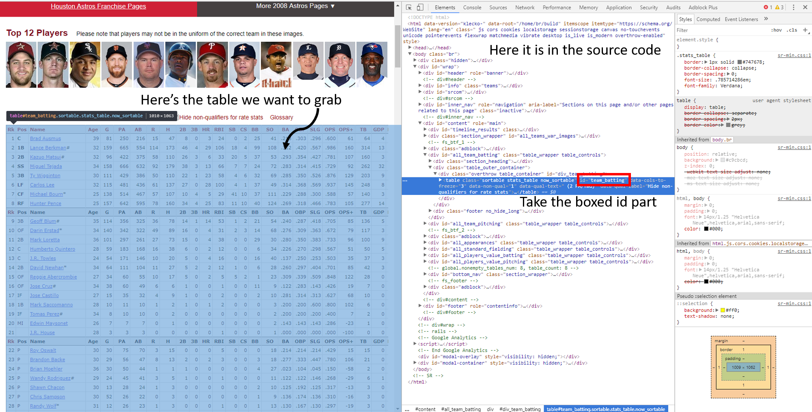

```{r setup, include=FALSE}
knitr::opts_chunk$set(echo = TRUE)

library(tidyverse)
library(stringr)
library(rvest)
library(stringr)
library(plotly)
library(randomForest)
```

<h2>Introduction</h2>

With 162 games played for 30 teams a year, anything can happen. <a href="https://www.youtube.com/watch?v=lBaCKT6eV90">Literally</a> <a href="https://i.imgur.com/sU69jpy.gifv">anything</a>. Baseball is also interesting, especially for data scientists, because more than any other sport, much of the sport is based of off statistics. Don't get it wrong, other sports also rely on similar statistics to develop the right stratagy. <a href="https://profootballtalk.nbcsports.com/2018/01/13/doug-pedersons-aggressiveness-on-fourth-downs-has-paid-off-for-the-eagles/">Doug Pederson uses statistics throughout every facet of how he runs the Philadelphia Eagles, especially on fourth downs</a>, <a href="http://www.phillyvoice.com/analysis-all-29-doug-pedersons-4th-down-go-it-calls-2008/"> and it paid of big</a>, <a href="https://streamable.com/n41sm">leading to the Eagles first Superbowl win</a> and led to <a href="https://www.youtube.com/watch?v=SN5eBYejv1g"> an epic celebration</a>.

Statistics, while important beforehand, got thrust to the forefront during the <a href="https://en.wikipedia.org/wiki/Moneyball">Moneyball Era</a>. For a brief moment in time, small market franchises, teams with less money to spend on recruiting players, such as the Oakland Athletics were able to gain a slight edge over big market teams, teams with a lot of money to spend recruiting players. Now that big market teams have caught on, how does a small market team, like the Houston Astros, beat a big market team, like the Los Angeles Dodgers <a href="https://www.youtube.com/watch?v=bzWeaf1zuL8">in game 7 of the World Series?</a> The answer: youth.

Young players are inexpensive, but a bit risky. They could turn out to be the next Mike Trout, or the next <a href="https://bleacherreport.com/articles/2757009-why-mark-appel-perhaps-the-biggest-bust-in-mlb-history-is-retiring-at-26">Mark Appel</a>. Most importantly, they have six years of team control when they first hit the major leagues, meaning that only the team the player is on can sign them, unless, of course, they don't want to. This has lead teams to trading their older, better players for young talent, rebuilding their farm system with potential stars. When those stars hit The Show and a team thinks they have the talent to make a World Series push, they will trade for other star players, often from teams looking to rebuild, to fill the gaps in talent that they have, sacrificing some of the youth in their minor leagues.

This study will follow five teams that have followed this model more or less to see how effective this stratagy is. The study will show how R can be used to easily manipulate data, removing less important stats and adding in more important ones, graph data, and make theories. The teams that this study will follow are the Chicago Cubs, the Houston Astros, the Philadelphia Phillies, the New York Yankees, and the Atlanta Braves. The Cubs and Astros were chosen as both ended long championship droughts with a young team. The Phillies went on to win the World Series in 2008, but crashed in 2011 and have been rebuilding since. The Braves looked poised to start making a run in the early 2010s, but crashed hard. Both the Phillies and Braves are coming out of the rebuilding and so far in 2018, both have looked successful. Yankees have always seemed good, but went through a brief rebuild in 2016. It was shorter than most others as they were already competitive, making the playoffs in 2017.

<h2>Data Gathering</h2>

There are two main sources of baseball data available online: <a href="fangraphs.com"></a> and <a href="baseball-reference.com"></a>. This study will take from baseball-reference. Data will be taken from baseball-reference to show how data can be important via CSV files and via the internet. Ten years of data will be taken from 2008 to 2008 since the 2018 season has just begun. The 2018 year will prove to be an interesting addition as every team, with maybe the exception of the Cubs, are off to great starts. Even then, Cubs are doing well, but not as well as one might expect.

There are a number of ways to import datasets into R, whether it by from an SQL database, CSV, or from an html webpage. Baseball-reference allows you to easily download CSVs, which you can put into your working directory. In the following example, we've taken the batting and pitching general statistics CSVs from the 2008 Chicago Cubs. The files were downloaded as xls files and converted to csv files using Excel. Using read_csv from the tidyverse makes this really easy.

```{R csv, results='hide', message=FALSE, warning=FALSE}
chc_08_bat <- read_csv("sportsref_chc_08_bat.xls.csv")
chc_08_pitch <- read_csv("sportsref_chc_08_pitch.xls.csv")
head(chc_08_pitch,10)
```
Easy, right? One command, one dataframe. Parsing from a website is a bit trickier as you have to locate where in the source html the table you want is stored. However, it does come with the benefit of not needing to download extra files. If we were to get all our data from downloaded files, we would have 100 CSVs. 10 years and five teams with two tables per adds up quickly. The following example shows how we can extract those tables directly from baseball-reference and into our program using the 2008 Houston Astros.

```{R html_get_example}
url_stros_08 <- "https://www.baseball-reference.com/teams/HOU/2008.shtml"
hou_08_bat <- url_stros_08 %>%
  read_html() %>%
  html_node("#team_batting") %>%
  html_table()
hou_08_pitch <- url_stros_08 %>%
  read_html() %>%
  html_node("#team_pitching") %>%
  html_table()
head(hou_08_bat,10)
```

Using the rvest package, we see that importing data in this way is pretty simple too. The hardest part is looking through the html source code to find where the table is located. Fortunately, baseball-reference has made this easy for us. Sometimes, websites aren't very good at stroing this tables, <a href="https://cdaw.gsfc.nasa.gov/CME_list/radio/waves_type2.html">like this example which has the table hardcoded in as plaintext</a>. In those cases, parsing the data gets a little more tricky, and regex comes into handy. Regex parsing will be covered in the next section.

One other thing to note in this example is the %>%. This is called pipe operator and it allows us to call multiple functions on a single dataset at once. We will use this many times when working with our data.



The following code obotains the rest of the data we need from the remaining pages, split up by team

```{R html_get_hou}
url_stros <- "https://www.baseball-reference.com/teams/HOU/2009.shtml"
hou_09_bat <- url_stros %>%
  read_html() %>%
  html_node("#team_batting") %>%
  html_table()
hou_09_pitch <- url_stros %>%
  read_html() %>%
  html_node("#team_pitching") %>%
  html_table()
url_stros <- "https://www.baseball-reference.com/teams/HOU/2010.shtml"
hou_10_bat <- url_stros %>%
  read_html() %>%
  html_node("#team_batting") %>%
  html_table()
hou_10_pitch <- url_stros %>%
  read_html() %>%
  html_node("#team_pitching") %>%
  html_table()
url_stros <- "https://www.baseball-reference.com/teams/HOU/2011.shtml"
hou_11_bat <- url_stros %>%
  read_html() %>%
  html_node("#team_batting") %>%
  html_table()
hou_11_pitch <- url_stros %>%
  read_html() %>%
  html_node("#team_pitching") %>%
  html_table()
url_stros <- "https://www.baseball-reference.com/teams/HOU/2012.shtml"
hou_12_bat <- url_stros %>%
  read_html() %>%
  html_node("#team_batting") %>%
  html_table()
hou_12_pitch <- url_stros %>%
  read_html() %>%
  html_node("#team_pitching") %>%
  html_table()
url_stros <- "https://www.baseball-reference.com/teams/HOU/2013.shtml"
hou_13_bat <- url_stros %>%
  read_html() %>%
  html_node("#team_batting") %>%
  html_table()
hou_13_pitch <- url_stros %>%
  read_html() %>%
  html_node("#team_pitching") %>%
  html_table()
url_stros <- "https://www.baseball-reference.com/teams/HOU/2014.shtml"
hou_14_bat <- url_stros %>%
  read_html() %>%
  html_node("#team_batting") %>%
  html_table()
hou_14_pitch <- url_stros %>%
  read_html() %>%
  html_node("#team_pitching") %>%
  html_table()
url_stros <- "https://www.baseball-reference.com/teams/HOU/2015.shtml"
hou_15_bat <- url_stros %>%
  read_html() %>%
  html_node("#team_batting") %>%
  html_table()
hou_15_pitch <- url_stros %>%
  read_html() %>%
  html_node("#team_pitching") %>%
  html_table()
url_stros <- "https://www.baseball-reference.com/teams/HOU/2016.shtml"
hou_16_bat <- url_stros %>%
  read_html() %>%
  html_node("#team_batting") %>%
  html_table()
hou_16_pitch <- url_stros %>%
  read_html() %>%
  html_node("#team_pitching") %>%
  html_table()
url_stros <- "https://www.baseball-reference.com/teams/HOU/2017.shtml"
hou_17_bat <- url_stros %>%
  read_html() %>%
  html_node("#team_batting") %>%
  html_table()
hou_17_pitch <- url_stros %>%
  read_html() %>%
  html_node("#team_pitching") %>%
  html_table()
```

Chicago Cubs:

```{R html_get_chc}
url_chc <- "https://www.baseball-reference.com/teams/CHC/2009.shtml"
chc_09_bat <- url_chc %>%
  read_html() %>%
  html_node("#team_batting") %>%
  html_table()
chc_09_pitch <- url_chc %>%
  read_html() %>%
  html_node("#team_pitching") %>%
  html_table()
url_chc <- "https://www.baseball-reference.com/teams/CHC/2010.shtml"
chc_10_bat <- url_chc %>%
  read_html() %>%
  html_node("#team_batting") %>%
  html_table()
chc_10_pitch <- url_chc %>%
  read_html() %>%
  html_node("#team_pitching") %>%
  html_table()
url_chc <- "https://www.baseball-reference.com/teams/CHC/2011.shtml"
chc_11_bat <- url_chc %>%
  read_html() %>%
  html_node("#team_batting") %>%
  html_table()
chc_11_pitch <- url_chc %>%
  read_html() %>%
  html_node("#team_pitching") %>%
  html_table()
url_chc <- "https://www.baseball-reference.com/teams/CHC/2012.shtml"
chc_12_bat <- url_chc %>%
  read_html() %>%
  html_node("#team_batting") %>%
  html_table()
chc_12_pitch <- url_chc %>%
  read_html() %>%
  html_node("#team_pitching") %>%
  html_table()
url_chc <- "https://www.baseball-reference.com/teams/CHC/2013.shtml"
chc_13_bat <- url_chc %>%
  read_html() %>%
  html_node("#team_batting") %>%
  html_table()
chc_13_pitch <- url_chc %>%
  read_html() %>%
  html_node("#team_pitching") %>%
  html_table()
url_chc <- "https://www.baseball-reference.com/teams/CHC/2014.shtml"
chc_14_bat <- url_chc %>%
  read_html() %>%
  html_node("#team_batting") %>%
  html_table()
chc_14_pitch <- url_chc %>%
  read_html() %>%
  html_node("#team_pitching") %>%
  html_table()
url_chc <- "https://www.baseball-reference.com/teams/CHC/2015.shtml"
chc_15_bat <- url_chc %>%
  read_html() %>%
  html_node("#team_batting") %>%
  html_table()
chc_15_pitch <- url_chc %>%
  read_html() %>%
  html_node("#team_pitching") %>%
  html_table()
url_chc <- "https://www.baseball-reference.com/teams/CHC/2016.shtml"
chc_16_bat <- url_chc %>%
  read_html() %>%
  html_node("#team_batting") %>%
  html_table()
chc_16_pitch <- url_chc %>%
  read_html() %>%
  html_node("#team_pitching") %>%
  html_table()
url_chc <- "https://www.baseball-reference.com/teams/CHC/2017.shtml"
chc_17_bat <- url_chc %>%
  read_html() %>%
  html_node("#team_batting") %>%
  html_table()
chc_17_pitch <- url_chc %>%
  read_html() %>%
  html_node("#team_pitching") %>%
  html_table()
```

Philadelphia Phillies

```{R html_get_phi}
url_phi <- "https://www.baseball-reference.com/teams/PHI/2008.shtml"
phi_08_bat <- url_phi %>%
  read_html() %>%
  html_node("#team_batting") %>%
  html_table()
phi_08_pitch <- url_phi %>%
  read_html() %>%
  html_node("#team_pitching") %>%
  html_table()
url_phi <- "https://www.baseball-reference.com/teams/PHI/2009.shtml"
phi_09_bat <- url_phi %>%
  read_html() %>%
  html_node("#team_batting") %>%
  html_table()
phi_09_pitch <- url_phi %>%
  read_html() %>%
  html_node("#team_pitching") %>%
  html_table()
url_phi <- "https://www.baseball-reference.com/teams/PHI/2010.shtml"
phi_10_bat <- url_phi %>%
  read_html() %>%
  html_node("#team_batting") %>%
  html_table()
phi_10_pitch <- url_phi %>%
  read_html() %>%
  html_node("#team_pitching") %>%
  html_table()
url_phi <- "https://www.baseball-reference.com/teams/PHI/2011.shtml"
phi_11_bat <- url_phi %>%
  read_html() %>%
  html_node("#team_batting") %>%
  html_table()
phi_11_pitch <- url_phi %>%
  read_html() %>%
  html_node("#team_pitching") %>%
  html_table()
url_phi <- "https://www.baseball-reference.com/teams/PHI/2012.shtml"
phi_12_bat <- url_phi %>%
  read_html() %>%
  html_node("#team_batting") %>%
  html_table()
phi_12_pitch <- url_phi %>%
  read_html() %>%
  html_node("#team_pitching") %>%
  html_table()
url_phi <- "https://www.baseball-reference.com/teams/PHI/2013.shtml"
phi_13_bat <- url_phi %>%
  read_html() %>%
  html_node("#team_batting") %>%
  html_table()
phi_13_pitch <- url_phi %>%
  read_html() %>%
  html_node("#team_pitching") %>%
  html_table()
url_phi <- "https://www.baseball-reference.com/teams/PHI/2014.shtml"
phi_14_bat <- url_phi %>%
  read_html() %>%
  html_node("#team_batting") %>%
  html_table()
phi_14_pitch <- url_phi %>%
  read_html() %>%
  html_node("#team_pitching") %>%
  html_table()
url_phi <- "https://www.baseball-reference.com/teams/PHI/2015.shtml"
phi_15_bat <- url_phi %>%
  read_html() %>%
  html_node("#team_batting") %>%
  html_table()
phi_15_pitch <- url_phi %>%
  read_html() %>%
  html_node("#team_pitching") %>%
  html_table()
url_phi <- "https://www.baseball-reference.com/teams/PHI/2016.shtml"
phi_16_bat <- url_phi %>%
  read_html() %>%
  html_node("#team_batting") %>%
  html_table()
phi_16_pitch <- url_phi %>%
  read_html() %>%
  html_node("#team_pitching") %>%
  html_table()
url_phi <- "https://www.baseball-reference.com/teams/PHI/2017.shtml"
phi_17_bat <- url_phi %>%
  read_html() %>%
  html_node("#team_batting") %>%
  html_table()
phi_17_pitch <- url_phi %>%
  read_html() %>%
  html_node("#team_pitching") %>%
  html_table()
```

New York Yankees

```{R html_get_nyy}
url_nyy <- "https://www.baseball-reference.com/teams/NYY/2008.shtml"
nyy_08_bat <- url_nyy %>%
  read_html() %>%
  html_node("#team_batting") %>%
  html_table()
nyy_08_pitch <- url_nyy %>%
  read_html() %>%
  html_node("#team_pitching") %>%
  html_table()
url_nyy <- "https://www.baseball-reference.com/teams/NYY/2009.shtml"
nyy_09_bat <- url_nyy %>%
  read_html() %>%
  html_node("#team_batting") %>%
  html_table()
nyy_09_pitch <- url_nyy %>%
  read_html() %>%
  html_node("#team_pitching") %>%
  html_table()
url_nyy <- "https://www.baseball-reference.com/teams/NYY/2010.shtml"
nyy_10_bat <- url_nyy %>%
  read_html() %>%
  html_node("#team_batting") %>%
  html_table()
nyy_10_pitch <- url_nyy %>%
  read_html() %>%
  html_node("#team_pitching") %>%
  html_table()
url_nyy <- "https://www.baseball-reference.com/teams/NYY/2011.shtml"
nyy_11_bat <- url_nyy %>%
  read_html() %>%
  html_node("#team_batting") %>%
  html_table()
nyy_11_pitch <- url_nyy %>%
  read_html() %>%
  html_node("#team_pitching") %>%
  html_table()
url_nyy <- "https://www.baseball-reference.com/teams/NYY/2012.shtml"
nyy_12_bat <- url_nyy %>%
  read_html() %>%
  html_node("#team_batting") %>%
  html_table()
nyy_12_pitch <- url_nyy %>%
  read_html() %>%
  html_node("#team_pitching") %>%
  html_table()
url_nyy <- "https://www.baseball-reference.com/teams/NYY/2013.shtml"
nyy_13_bat <- url_nyy %>%
  read_html() %>%
  html_node("#team_batting") %>%
  html_table()
nyy_13_pitch <- url_nyy %>%
  read_html() %>%
  html_node("#team_pitching") %>%
  html_table()
url_nyy <- "https://www.baseball-reference.com/teams/NYY/2014.shtml"
nyy_14_bat <- url_nyy %>%
  read_html() %>%
  html_node("#team_batting") %>%
  html_table()
nyy_14_pitch <- url_nyy %>%
  read_html() %>%
  html_node("#team_pitching") %>%
  html_table()
url_nyy <- "https://www.baseball-reference.com/teams/NYY/2015.shtml"
nyy_15_bat <- url_nyy %>%
  read_html() %>%
  html_node("#team_batting") %>%
  html_table()
nyy_15_pitch <- url_nyy %>%
  read_html() %>%
  html_node("#team_pitching") %>%
  html_table()
url_nyy <- "https://www.baseball-reference.com/teams/NYY/2016.shtml"
nyy_16_bat <- url_nyy %>%
  read_html() %>%
  html_node("#team_batting") %>%
  html_table()
nyy_16_pitch <- url_nyy %>%
  read_html() %>%
  html_node("#team_pitching") %>%
  html_table()
url_nyy <- "https://www.baseball-reference.com/teams/NYY/2017.shtml"
nyy_17_bat <- url_nyy %>%
  read_html() %>%
  html_node("#team_batting") %>%
  html_table()
nyy_17_pitch <- url_nyy %>%
  read_html() %>%
  html_node("#team_pitching") %>%
  html_table()
```

Atlanta Braves

```{R html_get_atl}
url_atl <- "https://www.baseball-reference.com/teams/ATL/2008.shtml"
atl_08_bat <- url_atl %>%
  read_html() %>%
  html_node("#team_batting") %>%
  html_table()
atl_08_pitch <- url_atl %>%
  read_html() %>%
  html_node("#team_pitching") %>%
  html_table()
url_atl <- "https://www.baseball-reference.com/teams/ATL/2009.shtml"
atl_09_bat <- url_atl %>%
  read_html() %>%
  html_node("#team_batting") %>%
  html_table()
atl_09_pitch <- url_atl %>%
  read_html() %>%
  html_node("#team_pitching") %>%
  html_table()
url_atl <- "https://www.baseball-reference.com/teams/ATL/2010.shtml"
atl_10_bat <- url_atl %>%
  read_html() %>%
  html_node("#team_batting") %>%
  html_table()
atl_10_pitch <- url_atl %>%
  read_html() %>%
  html_node("#team_pitching") %>%
  html_table()
url_atl <- "https://www.baseball-reference.com/teams/ATL/2011.shtml"
atl_11_bat <- url_atl %>%
  read_html() %>%
  html_node("#team_batting") %>%
  html_table()
atl_11_pitch <- url_atl %>%
  read_html() %>%
  html_node("#team_pitching") %>%
  html_table()
url_atl <- "https://www.baseball-reference.com/teams/ATL/2012.shtml"
atl_12_bat <- url_atl %>%
  read_html() %>%
  html_node("#team_batting") %>%
  html_table()
atl_12_pitch <- url_atl %>%
  read_html() %>%
  html_node("#team_pitching") %>%
  html_table()
url_atl <- "https://www.baseball-reference.com/teams/ATL/2013.shtml"
atl_13_bat <- url_atl %>%
  read_html() %>%
  html_node("#team_batting") %>%
  html_table()
atl_13_pitch <- url_atl %>%
  read_html() %>%
  html_node("#team_pitching") %>%
  html_table()
url_atl <- "https://www.baseball-reference.com/teams/ATL/2014.shtml"
atl_14_bat <- url_atl %>%
  read_html() %>%
  html_node("#team_batting") %>%
  html_table()
atl_14_pitch <- url_atl %>%
  read_html() %>%
  html_node("#team_pitching") %>%
  html_table()
url_atl <- "https://www.baseball-reference.com/teams/ATL/2015.shtml"
atl_15_bat <- url_atl %>%
  read_html() %>%
  html_node("#team_batting") %>%
  html_table()
atl_15_pitch <- url_atl %>%
  read_html() %>%
  html_node("#team_pitching") %>%
  html_table()
url_atl <- "https://www.baseball-reference.com/teams/ATL/2016.shtml"
atl_16_bat <- url_atl %>%
  read_html() %>%
  html_node("#team_batting") %>%
  html_table()
atl_16_pitch <- url_atl %>%
  read_html() %>%
  html_node("#team_pitching") %>%
  html_table()
url_atl <- "https://www.baseball-reference.com/teams/ATL/2017.shtml"
atl_17_bat <- url_atl %>%
  read_html() %>%
  html_node("#team_batting") %>%
  html_table()
atl_17_pitch <- url_atl %>%
  read_html() %>%
  html_node("#team_pitching") %>%
  html_table()
```

<h2>Parsing</h2>

Fortunately for us, all this data comes in pretty clean, but we still need to fix it up and make it pretty. For example, in all the dataframes, except for the one we imported as a CSV, repeat the attribute names, so we'll get rid of that. Additionally, most of the attributes are integers, but because of that pesky last line, they are listed as characters. To make matters worse, this line appears in the middle of each frame at seemingly random locations. The following example fixes this for the 2008 Atlanta Braves. The rest are fixed at the end of the example.

```{r parse_ex_1}
# This command will remove any row with an attribute in the Rk column with the value Rk
atl_08_bat <- atl_08_bat[!(atl_08_bat$Rk=="Rk"),]
atl_08_pitch <- atl_08_pitch[!(atl_08_pitch$Rk=="Rk"),]
# This will set each column to the proper type. The sapply applies the function to the specified columns
atl_08_bat[, c(1,4:28)] <- sapply(atl_08_bat[, c(1,4:28)], as.numeric)
atl_08_pitch[, c(1,4:34)] <- sapply(atl_08_pitch[, c(1,4:34)], as.numeric)
head(atl_08_pitch,10)
```

One other thing we need to do clean this data is with the names. For whatever reason, baseball-reference decided to use characters next to a person's name to show what side of the plate they bat from. No symbol means they bat right handed, a * means they bat left handed and a # means they bat from both sides of the plate. This blends a little into our next section, data management, because we are going to create a new attribute called bat_side that will contain a single character: R for righties, L for lefties, and S for switch hitters. We will also get rid of that symbol on the person's name. There is also one for the pitchers, but here we won't have to deal with switch pitchers as <a href="https://www.baseball-reference.com/players/v/vendipa01.shtml">Pat Vendette</a> did not play for any of these teams on during this era.

This is a good opportunity to introduce regex, which is contained in the stringr package for R. <a href="https://en.wikipedia.org/wiki/Regular_expression>Regex</a> is an important tool that anyone who works with computer programming should be familiar with. <a href="http://www.rstudio.com/wp-content/uploads/2016/09/RegExCheatsheet.pdf">Here's a regex cheat sheet for R</a>. By using regex, we can check through each string and parse out the important bits and discard the rest.

```{r regex_ex}
atl_08_bat <- atl_08_bat %>%
  mutate(bat_side=ifelse(str_detect(Name,"\\*"),'L', ifelse(str_detect(Name,"#"),'S','R'))) %>%
  mutate(Name = str_extract(Name,"[[:alpha:]]+.?[[:alpha:]]+.? [[:alpha:]]+"))
atl_08_pitch <- atl_08_pitch %>%
  mutate(pitch_side=ifelse(str_detect(Name,"\\*"),'L', 'R')) %>%
  mutate(Name = str_extract(Name,"[[:alpha:]]+.?[[:alpha:]]+.? [[:alpha:]]+"))
head(atl_08_bat,10)
```

So once you understand regex, things become pretty easy. Now we speed up the process, doing this for our 100 dataframes as seen below for your viewing pleasure.

```{r parse_atl}
atl_09_bat <- atl_09_bat[!(atl_09_bat$Rk=="Rk"),]
atl_09_pitch <- atl_09_pitch[!(atl_09_pitch$Rk=="Rk"),]
atl_09_bat[, c(1,4:28)] <- sapply(atl_09_bat[, c(1,4:28)], as.numeric)
atl_09_pitch[, c(1,4:34)] <- sapply(atl_09_pitch[, c(1,4:34)], as.numeric)
atl_09_bat <- atl_09_bat %>%
  mutate(bat_side=ifelse(str_detect(Name,"\\*"),'L', ifelse(str_detect(Name,"#"),'S','R'))) %>%
  mutate(Name = str_extract(Name,"[[:alpha:]]+.?[[:alpha:]]+.? [[:alpha:]]+"))
atl_09_pitch <- atl_09_pitch %>%
  mutate(pitch_side=ifelse(str_detect(Name,"\\*"),'L', 'R')) %>%
  mutate(Name = str_extract(Name,"[[:alpha:]]+.?[[:alpha:]]+.? [[:alpha:]]+"))

atl_10_bat <- atl_10_bat[!(atl_10_bat$Rk=="Rk"),]
atl_10_pitch <- atl_10_pitch[!(atl_10_pitch$Rk=="Rk"),]
atl_10_bat[, c(1,4:28)] <- sapply(atl_10_bat[, c(1,4:28)], as.numeric)
atl_10_pitch[, c(1,4:34)] <- sapply(atl_10_pitch[, c(1,4:34)], as.numeric)
atl_10_bat <- atl_10_bat %>%
  mutate(bat_side=ifelse(str_detect(Name,"\\*"),'L', ifelse(str_detect(Name,"#"),'S','R'))) %>%
  mutate(Name = str_extract(Name,"[[:alpha:]]+.?[[:alpha:]]+.? [[:alpha:]]+"))
atl_10_pitch <- atl_10_pitch %>%
  mutate(pitch_side=ifelse(str_detect(Name,"\\*"),'L', 'R')) %>%
  mutate(Name = str_extract(Name,"[[:alpha:]]+.?[[:alpha:]]+.? [[:alpha:]]+"))

atl_11_bat <- atl_11_bat[!(atl_11_bat$Rk=="Rk"),]
atl_11_pitch <- atl_11_pitch[!(atl_11_pitch$Rk=="Rk"),]
atl_11_bat[, c(1,4:28)] <- sapply(atl_11_bat[, c(1,4:28)], as.numeric)
atl_11_pitch[, c(1,4:34)] <- sapply(atl_11_pitch[, c(1,4:34)], as.numeric)
atl_11_bat <- atl_11_bat %>%
  mutate(bat_side=ifelse(str_detect(Name,"\\*"),'L', ifelse(str_detect(Name,"#"),'S','R'))) %>%
  mutate(Name = str_extract(Name,"[[:alpha:]]+.?[[:alpha:]]+.? [[:alpha:]]+"))
atl_11_pitch <- atl_11_pitch %>%
  mutate(pitch_side=ifelse(str_detect(Name,"\\*"),'L', 'R')) %>%
  mutate(Name = str_extract(Name,"[[:alpha:]]+.?[[:alpha:]]+.? [[:alpha:]]+"))

atl_12_bat <- atl_12_bat[!(atl_12_bat$Rk=="Rk"),]
atl_12_pitch <- atl_12_pitch[!(atl_12_pitch$Rk=="Rk"),]
atl_12_bat[, c(1,4:28)] <- sapply(atl_12_bat[, c(1,4:28)], as.numeric)
atl_12_pitch[, c(1,4:34)] <- sapply(atl_12_pitch[, c(1,4:34)], as.numeric)
atl_12_bat <- atl_12_bat %>%
  mutate(bat_side=ifelse(str_detect(Name,"\\*"),'L', ifelse(str_detect(Name,"#"),'S','R'))) %>%
  mutate(Name = str_extract(Name,"[[:alpha:]]+.?[[:alpha:]]+.? [[:alpha:]]+"))
atl_12_pitch <- atl_12_pitch %>%
  mutate(pitch_side=ifelse(str_detect(Name,"\\*"),'L', 'R')) %>%
  mutate(Name = str_extract(Name,"[[:alpha:]]+.?[[:alpha:]]+.? [[:alpha:]]+"))

atl_13_bat <- atl_13_bat[!(atl_13_bat$Rk=="Rk"),]
atl_13_pitch <- atl_13_pitch[!(atl_13_pitch$Rk=="Rk"),]
atl_13_bat[, c(1,4:28)] <- sapply(atl_13_bat[, c(1,4:28)], as.numeric)
atl_13_pitch[, c(1,4:34)] <- sapply(atl_13_pitch[, c(1,4:34)], as.numeric)
atl_13_bat <- atl_13_bat %>%
  mutate(bat_side=ifelse(str_detect(Name,"\\*"),'L', ifelse(str_detect(Name,"#"),'S','R'))) %>%
  mutate(Name = str_extract(Name,"[[:alpha:]]+.?[[:alpha:]]+.? [[:alpha:]]+"))
atl_13_pitch <- atl_13_pitch %>%
  mutate(pitch_side=ifelse(str_detect(Name,"\\*"),'L', 'R')) %>%
  mutate(Name = str_extract(Name,"[[:alpha:]]+.?[[:alpha:]]+.? [[:alpha:]]+"))

atl_14_bat <- atl_14_bat[!(atl_14_bat$Rk=="Rk"),]
atl_14_pitch <- atl_14_pitch[!(atl_14_pitch$Rk=="Rk"),]
atl_14_bat[, c(1,4:28)] <- sapply(atl_14_bat[, c(1,4:28)], as.numeric)
atl_14_pitch[, c(1,4:34)] <- sapply(atl_14_pitch[, c(1,4:34)], as.numeric)
atl_14_bat <- atl_14_bat %>%
  mutate(bat_side=ifelse(str_detect(Name,"\\*"),'L', ifelse(str_detect(Name,"#"),'S','R'))) %>%
  mutate(Name = str_extract(Name,"[[:alpha:]]+.?[[:alpha:]]+.? [[:alpha:]]+"))
atl_14_pitch <- atl_14_pitch %>%
  mutate(pitch_side=ifelse(str_detect(Name,"\\*"),'L', 'R')) %>%
  mutate(Name = str_extract(Name,"[[:alpha:]]+.?[[:alpha:]]+.? [[:alpha:]]+"))

atl_15_bat <- atl_15_bat[!(atl_15_bat$Rk=="Rk"),]
atl_15_pitch <- atl_15_pitch[!(atl_15_pitch$Rk=="Rk"),]
atl_15_bat[, c(1,4:28)] <- sapply(atl_15_bat[, c(1,4:28)], as.numeric)
atl_15_pitch[, c(1,4:34)] <- sapply(atl_15_pitch[, c(1,4:34)], as.numeric)
atl_15_bat <- atl_15_bat %>%
  mutate(bat_side=ifelse(str_detect(Name,"\\*"),'L', ifelse(str_detect(Name,"#"),'S','R'))) %>%
  mutate(Name = str_extract(Name,"[[:alpha:]]+.?[[:alpha:]]+.? [[:alpha:]]+"))
atl_15_pitch <- atl_15_pitch %>%
  mutate(pitch_side=ifelse(str_detect(Name,"\\*"),'L', 'R')) %>%
  mutate(Name = str_extract(Name,"[[:alpha:]]+.?[[:alpha:]]+.? [[:alpha:]]+"))

atl_16_bat <- atl_16_bat[!(atl_16_bat$Rk=="Rk"),]
atl_16_pitch <- atl_10_pitch[!(atl_16_pitch$Rk=="Rk"),]
atl_16_bat[, c(1,4:28)] <- sapply(atl_16_bat[, c(1,4:28)], as.numeric)
atl_16_pitch[, c(1,4:34)] <- sapply(atl_16_pitch[, c(1,4:34)], as.numeric)
atl_16_bat <- atl_16_bat %>%
  mutate(bat_side=ifelse(str_detect(Name,"\\*"),'L', ifelse(str_detect(Name,"#"),'S','R'))) %>%
  mutate(Name = str_extract(Name,"[[:alpha:]]+.?[[:alpha:]]+.? [[:alpha:]]+"))
atl_16_pitch <- atl_16_pitch %>%
  mutate(pitch_side=ifelse(str_detect(Name,"\\*"),'L', 'R')) %>%
  mutate(Name = str_extract(Name,"[[:alpha:]]+.?[[:alpha:]]+.? [[:alpha:]]+"))

atl_17_bat <- atl_10_bat[!(atl_17_bat$Rk=="Rk"),]
atl_17_pitch <- atl_10_pitch[!(atl_17_pitch$Rk=="Rk"),]
atl_17_bat[, c(1,4:28)] <- sapply(atl_17_bat[, c(1,4:28)], as.numeric)
atl_17_pitch[, c(1,4:34)] <- sapply(atl_17_pitch[, c(1,4:34)], as.numeric)
atl_17_bat <- atl_17_bat %>%
  mutate(bat_side=ifelse(str_detect(Name,"\\*"),'L', ifelse(str_detect(Name,"#"),'S','R'))) %>%
  mutate(Name = str_extract(Name,"[[:alpha:]]+.?[[:alpha:]]+.? [[:alpha:]]+"))
atl_17_pitch <- atl_17_pitch %>%
  mutate(pitch_side=ifelse(str_detect(Name,"\\*"),'L', 'R')) %>%
  mutate(Name = str_extract(Name,"[[:alpha:]]+.?[[:alpha:]]+.? [[:alpha:]]+"))
```

The other teams' code to parse the data is hidden just so this document isn't obscenely long, but it was proccessed.

```{r parse_chc, include=FALSE}
chc_08_bat <- chc_08_bat[!(chc_08_bat$Rk=="Rk"),]
chc_08_pitch <- chc_08_pitch[!(chc_08_pitch$Rk=="Rk"),]
chc_08_bat[, c(1,4:28)] <- sapply(chc_08_bat[, c(1,4:28)], as.numeric)
chc_08_pitch[, c(1,4:34)] <- sapply(chc_08_pitch[, c(1,4:34)], as.numeric)
chc_08_bat <- chc_08_bat %>%
  mutate(bat_side=ifelse(str_detect(Name,"\\*"),'L', ifelse(str_detect(Name,"#"),'S','R'))) %>%
  mutate(Name = str_extract(Name,"[[:alpha:]]+.?[[:alpha:]]+.? [[:alpha:]]+"))
chc_08_pitch <- chc_08_pitch %>%
  mutate(pitch_side=ifelse(str_detect(Name,"\\*"),'L', 'R')) %>%
  mutate(Name = str_extract(Name,"[[:alpha:]]+.?[[:alpha:]]+.? [[:alpha:]]+"))

chc_09_bat <- chc_09_bat[!(chc_09_bat$Rk=="Rk"),]
chc_09_pitch <- chc_09_pitch[!(chc_09_pitch$Rk=="Rk"),]
chc_09_bat[, c(1,4:28)] <- sapply(chc_09_bat[, c(1,4:28)], as.numeric)
chc_09_pitch[, c(1,4:34)] <- sapply(chc_09_pitch[, c(1,4:34)], as.numeric)
chc_09_bat <- chc_09_bat %>%
  mutate(bat_side=ifelse(str_detect(Name,"\\*"),'L', ifelse(str_detect(Name,"#"),'S','R'))) %>%
  mutate(Name = str_extract(Name,"[[:alpha:]]+.?[[:alpha:]]+.? [[:alpha:]]+"))
chc_09_pitch <- chc_09_pitch %>%
  mutate(pitch_side=ifelse(str_detect(Name,"\\*"),'L', 'R')) %>%
  mutate(Name = str_extract(Name,"[[:alpha:]]+.?[[:alpha:]]+.? [[:alpha:]]+"))

chc_10_bat <- chc_10_bat[!(chc_10_bat$Rk=="Rk"),]
chc_10_pitch <- chc_10_pitch[!(chc_10_pitch$Rk=="Rk"),]
chc_10_bat[, c(1,4:28)] <- sapply(chc_10_bat[, c(1,4:28)], as.numeric)
chc_10_pitch[, c(1,4:34)] <- sapply(chc_10_pitch[, c(1,4:34)], as.numeric)
chc_10_bat <- chc_10_bat %>%
  mutate(bat_side=ifelse(str_detect(Name,"\\*"),'L', ifelse(str_detect(Name,"#"),'S','R'))) %>%
  mutate(Name = str_extract(Name,"[[:alpha:]]+.?[[:alpha:]]+.? [[:alpha:]]+"))
chc_10_pitch <- chc_10_pitch %>%
  mutate(pitch_side=ifelse(str_detect(Name,"\\*"),'L', 'R')) %>%
  mutate(Name = str_extract(Name,"[[:alpha:]]+.?[[:alpha:]]+.? [[:alpha:]]+"))

chc_11_bat <- chc_11_bat[!(chc_11_bat$Rk=="Rk"),]
chc_11_pitch <- chc_11_pitch[!(chc_11_pitch$Rk=="Rk"),]
chc_11_bat[, c(1,4:28)] <- sapply(chc_11_bat[, c(1,4:28)], as.numeric)
chc_11_pitch[, c(1,4:34)] <- sapply(chc_11_pitch[, c(1,4:34)], as.numeric)
chc_11_bat <- chc_11_bat %>%
  mutate(bat_side=ifelse(str_detect(Name,"\\*"),'L', ifelse(str_detect(Name,"#"),'S','R'))) %>%
  mutate(Name = str_extract(Name,"[[:alpha:]]+.?[[:alpha:]]+.? [[:alpha:]]+"))
chc_11_pitch <- chc_11_pitch %>%
  mutate(pitch_side=ifelse(str_detect(Name,"\\*"),'L', 'R')) %>%
  mutate(Name = str_extract(Name,"[[:alpha:]]+.?[[:alpha:]]+.? [[:alpha:]]+"))

chc_12_bat <- chc_12_bat[!(chc_12_bat$Rk=="Rk"),]
chc_12_pitch <- chc_12_pitch[!(chc_12_pitch$Rk=="Rk"),]
chc_12_bat[, c(1,4:28)] <- sapply(chc_12_bat[, c(1,4:28)], as.numeric)
chc_12_pitch[, c(1,4:34)] <- sapply(chc_12_pitch[, c(1,4:34)], as.numeric)
chc_12_bat <- chc_12_bat %>%
  mutate(bat_side=ifelse(str_detect(Name,"\\*"),'L', ifelse(str_detect(Name,"#"),'S','R'))) %>%
  mutate(Name = str_extract(Name,"[[:alpha:]]+.?[[:alpha:]]+.? [[:alpha:]]+"))
chc_12_pitch <- chc_12_pitch %>%
  mutate(pitch_side=ifelse(str_detect(Name,"\\*"),'L', 'R')) %>%
  mutate(Name = str_extract(Name,"[[:alpha:]]+.?[[:alpha:]]+.? [[:alpha:]]+"))

chc_13_bat <- chc_13_bat[!(chc_13_bat$Rk=="Rk"),]
chc_13_pitch <- chc_13_pitch[!(chc_13_pitch$Rk=="Rk"),]
chc_13_bat[, c(1,4:28)] <- sapply(chc_13_bat[, c(1,4:28)], as.numeric)
chc_13_pitch[, c(1,4:34)] <- sapply(chc_13_pitch[, c(1,4:34)], as.numeric)
chc_13_bat <- chc_13_bat %>%
  mutate(bat_side=ifelse(str_detect(Name,"\\*"),'L', ifelse(str_detect(Name,"#"),'S','R'))) %>%
  mutate(Name = str_extract(Name,"[[:alpha:]]+.?[[:alpha:]]+.? [[:alpha:]]+"))
chc_13_pitch <- chc_13_pitch %>%
  mutate(pitch_side=ifelse(str_detect(Name,"\\*"),'L', 'R')) %>%
  mutate(Name = str_extract(Name,"[[:alpha:]]+.?[[:alpha:]]+.? [[:alpha:]]+"))

chc_14_bat <- chc_14_bat[!(chc_14_bat$Rk=="Rk"),]
chc_14_pitch <- chc_14_pitch[!(chc_14_pitch$Rk=="Rk"),]
chc_14_bat[, c(1,4:28)] <- sapply(chc_14_bat[, c(1,4:28)], as.numeric)
chc_14_pitch[, c(1,4:34)] <- sapply(chc_14_pitch[, c(1,4:34)], as.numeric)
chc_14_bat <- chc_14_bat %>%
  mutate(bat_side=ifelse(str_detect(Name,"\\*"),'L', ifelse(str_detect(Name,"#"),'S','R'))) %>%
  mutate(Name = str_extract(Name,"[[:alpha:]]+.?[[:alpha:]]+.? [[:alpha:]]+"))
chc_14_pitch <- chc_14_pitch %>%
  mutate(pitch_side=ifelse(str_detect(Name,"\\*"),'L', 'R')) %>%
  mutate(Name = str_extract(Name,"[[:alpha:]]+.?[[:alpha:]]+.? [[:alpha:]]+"))

chc_15_bat <- chc_15_bat[!(chc_15_bat$Rk=="Rk"),]
chc_15_pitch <- chc_15_pitch[!(chc_15_pitch$Rk=="Rk"),]
chc_15_bat[, c(1,4:28)] <- sapply(chc_15_bat[, c(1,4:28)], as.numeric)
chc_15_pitch[, c(1,4:34)] <- sapply(chc_15_pitch[, c(1,4:34)], as.numeric)
chc_15_bat <- chc_15_bat %>%
  mutate(bat_side=ifelse(str_detect(Name,"\\*"),'L', ifelse(str_detect(Name,"#"),'S','R'))) %>%
  mutate(Name = str_extract(Name,"[[:alpha:]]+.?[[:alpha:]]+.? [[:alpha:]]+"))
chc_15_pitch <- chc_15_pitch %>%
  mutate(pitch_side=ifelse(str_detect(Name,"\\*"),'L', 'R')) %>%
  mutate(Name = str_extract(Name,"[[:alpha:]]+.?[[:alpha:]]+.? [[:alpha:]]+"))

chc_16_bat <- chc_16_bat[!(chc_16_bat$Rk=="Rk"),]
chc_16_pitch <- chc_10_pitch[!(chc_16_pitch$Rk=="Rk"),]
chc_16_bat[, c(1,4:28)] <- sapply(chc_16_bat[, c(1,4:28)], as.numeric)
chc_16_pitch[, c(1,4:34)] <- sapply(chc_16_pitch[, c(1,4:34)], as.numeric)
chc_16_bat <- chc_16_bat %>%
  mutate(bat_side=ifelse(str_detect(Name,"\\*"),'L', ifelse(str_detect(Name,"#"),'S','R'))) %>%
  mutate(Name = str_extract(Name,"[[:alpha:]]+.?[[:alpha:]]+.? [[:alpha:]]+"))
chc_16_pitch <- chc_16_pitch %>%
  mutate(pitch_side=ifelse(str_detect(Name,"\\*"),'L', 'R')) %>%
  mutate(Name = str_extract(Name,"[[:alpha:]]+.?[[:alpha:]]+.? [[:alpha:]]+"))

chc_17_bat <- chc_10_bat[!(chc_17_bat$Rk=="Rk"),]
chc_17_pitch <- chc_10_pitch[!(chc_17_pitch$Rk=="Rk"),]
chc_17_bat[, c(1,4:28)] <- sapply(chc_17_bat[, c(1,4:28)], as.numeric)
chc_17_pitch[, c(1,4:34)] <- sapply(chc_17_pitch[, c(1,4:34)], as.numeric)
chc_17_bat <- chc_17_bat %>%
  mutate(bat_side=ifelse(str_detect(Name,"\\*"),'L', ifelse(str_detect(Name,"#"),'S','R'))) %>%
  mutate(Name = str_extract(Name,"[[:alpha:]]+.?[[:alpha:]]+.? [[:alpha:]]+"))
chc_17_pitch <- chc_17_pitch %>%
  mutate(pitch_side=ifelse(str_detect(Name,"\\*"),'L', 'R')) %>%
  mutate(Name = str_extract(Name,"[[:alpha:]]+.?[[:alpha:]]+.? [[:alpha:]]+"))
```

```{r parse_hou, include=FALSE}
hou_08_bat <- hou_08_bat[!(hou_08_bat$Rk=="Rk"),]
hou_08_pitch <- hou_08_pitch[!(hou_08_pitch$Rk=="Rk"),]
hou_08_bat[, c(1,4:28)] <- sapply(hou_08_bat[, c(1,4:28)], as.numeric)
hou_08_pitch[, c(1,4:34)] <- sapply(hou_08_pitch[, c(1,4:34)], as.numeric)
hou_08_bat <- hou_08_bat %>%
  mutate(bat_side=ifelse(str_detect(Name,"\\*"),'L', ifelse(str_detect(Name,"#"),'S','R'))) %>%
  mutate(Name = str_extract(Name,"[[:alpha:]]+.?[[:alpha:]]+.? [[:alpha:]]+"))
hou_08_pitch <- hou_08_pitch %>%
  mutate(pitch_side=ifelse(str_detect(Name,"\\*"),'L', 'R')) %>%
  mutate(Name = str_extract(Name,"[[:alpha:]]+.?[[:alpha:]]+.? [[:alpha:]]+"))

hou_09_bat <- hou_09_bat[!(hou_09_bat$Rk=="Rk"),]
hou_09_pitch <- hou_09_pitch[!(hou_09_pitch$Rk=="Rk"),]
hou_09_bat[, c(1,4:28)] <- sapply(hou_09_bat[, c(1,4:28)], as.numeric)
hou_09_pitch[, c(1,4:34)] <- sapply(hou_09_pitch[, c(1,4:34)], as.numeric)
hou_09_bat <- hou_09_bat %>%
  mutate(bat_side=ifelse(str_detect(Name,"\\*"),'L', ifelse(str_detect(Name,"#"),'S','R'))) %>%
  mutate(Name = str_extract(Name,"[[:alpha:]]+.?[[:alpha:]]+.? [[:alpha:]]+"))
hou_09_pitch <- hou_09_pitch %>%
  mutate(pitch_side=ifelse(str_detect(Name,"\\*"),'L', 'R')) %>%
  mutate(Name = str_extract(Name,"[[:alpha:]]+.?[[:alpha:]]+.? [[:alpha:]]+"))

hou_10_bat <- hou_10_bat[!(hou_10_bat$Rk=="Rk"),]
hou_10_pitch <- hou_10_pitch[!(hou_10_pitch$Rk=="Rk"),]
hou_10_bat[, c(1,4:28)] <- sapply(hou_10_bat[, c(1,4:28)], as.numeric)
hou_10_pitch[, c(1,4:34)] <- sapply(hou_10_pitch[, c(1,4:34)], as.numeric)
hou_10_bat <- hou_10_bat %>%
  mutate(bat_side=ifelse(str_detect(Name,"\\*"),'L', ifelse(str_detect(Name,"#"),'S','R'))) %>%
  mutate(Name = str_extract(Name,"[[:alpha:]]+.?[[:alpha:]]+.? [[:alpha:]]+"))
hou_10_pitch <- hou_10_pitch %>%
  mutate(pitch_side=ifelse(str_detect(Name,"\\*"),'L', 'R')) %>%
  mutate(Name = str_extract(Name,"[[:alpha:]]+.?[[:alpha:]]+.? [[:alpha:]]+"))

hou_11_bat <- hou_11_bat[!(hou_11_bat$Rk=="Rk"),]
hou_11_pitch <- hou_11_pitch[!(hou_11_pitch$Rk=="Rk"),]
hou_11_bat[, c(1,4:28)] <- sapply(hou_11_bat[, c(1,4:28)], as.numeric)
hou_11_pitch[, c(1,4:34)] <- sapply(hou_11_pitch[, c(1,4:34)], as.numeric)
hou_11_bat <- hou_11_bat %>%
  mutate(bat_side=ifelse(str_detect(Name,"\\*"),'L', ifelse(str_detect(Name,"#"),'S','R'))) %>%
  mutate(Name = str_extract(Name,"[[:alpha:]]+.?[[:alpha:]]+.? [[:alpha:]]+"))
hou_11_pitch <- hou_11_pitch %>%
  mutate(pitch_side=ifelse(str_detect(Name,"\\*"),'L', 'R')) %>%
  mutate(Name = str_extract(Name,"[[:alpha:]]+.?[[:alpha:]]+.? [[:alpha:]]+"))

hou_12_bat <- hou_12_bat[!(hou_12_bat$Rk=="Rk"),]
hou_12_pitch <- hou_12_pitch[!(hou_12_pitch$Rk=="Rk"),]
hou_12_bat[, c(1,4:28)] <- sapply(hou_12_bat[, c(1,4:28)], as.numeric)
hou_12_pitch[, c(1,4:34)] <- sapply(hou_12_pitch[, c(1,4:34)], as.numeric)
hou_12_bat <- hou_12_bat %>%
  mutate(bat_side=ifelse(str_detect(Name,"\\*"),'L', ifelse(str_detect(Name,"#"),'S','R'))) %>%
  mutate(Name = str_extract(Name,"[[:alpha:]]+.?[[:alpha:]]+.? [[:alpha:]]+"))
hou_12_pitch <- hou_12_pitch %>%
  mutate(pitch_side=ifelse(str_detect(Name,"\\*"),'L', 'R')) %>%
  mutate(Name = str_extract(Name,"[[:alpha:]]+.?[[:alpha:]]+.? [[:alpha:]]+"))

hou_13_bat <- hou_13_bat[!(hou_13_bat$Rk=="Rk"),]
hou_13_pitch <- hou_13_pitch[!(hou_13_pitch$Rk=="Rk"),]
hou_13_bat[, c(1,4:28)] <- sapply(hou_13_bat[, c(1,4:28)], as.numeric)
hou_13_pitch[, c(1,4:34)] <- sapply(hou_13_pitch[, c(1,4:34)], as.numeric)
hou_13_bat <- hou_13_bat %>%
  mutate(bat_side=ifelse(str_detect(Name,"\\*"),'L', ifelse(str_detect(Name,"#"),'S','R'))) %>%
  mutate(Name = str_extract(Name,"[[:alpha:]]+.?[[:alpha:]]+.? [[:alpha:]]+"))
hou_13_pitch <- hou_13_pitch %>%
  mutate(pitch_side=ifelse(str_detect(Name,"\\*"),'L', 'R')) %>%
  mutate(Name = str_extract(Name,"[[:alpha:]]+.?[[:alpha:]]+.? [[:alpha:]]+"))

hou_14_bat <- hou_14_bat[!(hou_14_bat$Rk=="Rk"),]
hou_14_pitch <- hou_14_pitch[!(hou_14_pitch$Rk=="Rk"),]
hou_14_bat[, c(1,4:28)] <- sapply(hou_14_bat[, c(1,4:28)], as.numeric)
hou_14_pitch[, c(1,4:34)] <- sapply(hou_14_pitch[, c(1,4:34)], as.numeric)
hou_14_bat <- hou_14_bat %>%
  mutate(bat_side=ifelse(str_detect(Name,"\\*"),'L', ifelse(str_detect(Name,"#"),'S','R'))) %>%
  mutate(Name = str_extract(Name,"[[:alpha:]]+.?[[:alpha:]]+.? [[:alpha:]]+"))
hou_14_pitch <- hou_14_pitch %>%
  mutate(pitch_side=ifelse(str_detect(Name,"\\*"),'L', 'R')) %>%
  mutate(Name = str_extract(Name,"[[:alpha:]]+.?[[:alpha:]]+.? [[:alpha:]]+"))

hou_15_bat <- hou_15_bat[!(hou_15_bat$Rk=="Rk"),]
hou_15_pitch <- hou_15_pitch[!(hou_15_pitch$Rk=="Rk"),]
hou_15_bat[, c(1,4:28)] <- sapply(hou_15_bat[, c(1,4:28)], as.numeric)
hou_15_pitch[, c(1,4:34)] <- sapply(hou_15_pitch[, c(1,4:34)], as.numeric)
hou_15_bat <- hou_15_bat %>%
  mutate(bat_side=ifelse(str_detect(Name,"\\*"),'L', ifelse(str_detect(Name,"#"),'S','R'))) %>%
  mutate(Name = str_extract(Name,"[[:alpha:]]+.?[[:alpha:]]+.? [[:alpha:]]+"))
hou_15_pitch <- hou_15_pitch %>%
  mutate(pitch_side=ifelse(str_detect(Name,"\\*"),'L', 'R')) %>%
  mutate(Name = str_extract(Name,"[[:alpha:]]+.?[[:alpha:]]+.? [[:alpha:]]+"))

hou_16_bat <- hou_16_bat[!(hou_16_bat$Rk=="Rk"),]
hou_16_pitch <- hou_10_pitch[!(hou_16_pitch$Rk=="Rk"),]
hou_16_bat[, c(1,4:28)] <- sapply(hou_16_bat[, c(1,4:28)], as.numeric)
hou_16_pitch[, c(1,4:34)] <- sapply(hou_16_pitch[, c(1,4:34)], as.numeric)
hou_16_bat <- hou_16_bat %>%
  mutate(bat_side=ifelse(str_detect(Name,"\\*"),'L', ifelse(str_detect(Name,"#"),'S','R'))) %>%
  mutate(Name = str_extract(Name,"[[:alpha:]]+.?[[:alpha:]]+.? [[:alpha:]]+"))
hou_16_pitch <- hou_16_pitch %>%
  mutate(pitch_side=ifelse(str_detect(Name,"\\*"),'L', 'R')) %>%
  mutate(Name = str_extract(Name,"[[:alpha:]]+.?[[:alpha:]]+.? [[:alpha:]]+"))

hou_17_bat <- hou_10_bat[!(hou_17_bat$Rk=="Rk"),]
hou_17_pitch <- hou_10_pitch[!(hou_17_pitch$Rk=="Rk"),]
hou_17_bat[, c(1,4:28)] <- sapply(hou_17_bat[, c(1,4:28)], as.numeric)
hou_17_pitch[, c(1,4:34)] <- sapply(hou_17_pitch[, c(1,4:34)], as.numeric)
hou_17_bat <- hou_17_bat %>%
  mutate(bat_side=ifelse(str_detect(Name,"\\*"),'L', ifelse(str_detect(Name,"#"),'S','R'))) %>%
  mutate(Name = str_extract(Name,"[[:alpha:]]+.?[[:alpha:]]+.? [[:alpha:]]+"))
hou_17_pitch <- hou_17_pitch %>%
  mutate(pitch_side=ifelse(str_detect(Name,"\\*"),'L', 'R')) %>%
  mutate(Name = str_extract(Name,"[[:alpha:]]+.?[[:alpha:]]+.? [[:alpha:]]+"))
```

```{r parse_nyy, include=FALSE}
nyy_08_bat <- nyy_08_bat[!(nyy_08_bat$Rk=="Rk"),]
nyy_08_pitch <- nyy_08_pitch[!(nyy_08_pitch$Rk=="Rk"),]
nyy_08_bat[, c(1,4:28)] <- sapply(nyy_08_bat[, c(1,4:28)], as.numeric)
nyy_08_pitch[, c(1,4:34)] <- sapply(nyy_08_pitch[, c(1,4:34)], as.numeric)
nyy_08_bat <- nyy_08_bat %>%
  mutate(bat_side=ifelse(str_detect(Name,"\\*"),'L', ifelse(str_detect(Name,"#"),'S','R'))) %>%
  mutate(Name = str_extract(Name,"[[:alpha:]]+.?[[:alpha:]]+.? [[:alpha:]]+"))
nyy_08_pitch <- nyy_08_pitch %>%
  mutate(pitch_side=ifelse(str_detect(Name,"\\*"),'L', 'R')) %>%
  mutate(Name = str_extract(Name,"[[:alpha:]]+.?[[:alpha:]]+.? [[:alpha:]]+"))

nyy_09_bat <- nyy_09_bat[!(nyy_09_bat$Rk=="Rk"),]
nyy_09_pitch <- nyy_09_pitch[!(nyy_09_pitch$Rk=="Rk"),]
nyy_09_bat[, c(1,4:28)] <- sapply(nyy_09_bat[, c(1,4:28)], as.numeric)
nyy_09_pitch[, c(1,4:34)] <- sapply(nyy_09_pitch[, c(1,4:34)], as.numeric)
nyy_09_bat <- nyy_09_bat %>%
  mutate(bat_side=ifelse(str_detect(Name,"\\*"),'L', ifelse(str_detect(Name,"#"),'S','R'))) %>%
  mutate(Name = str_extract(Name,"[[:alpha:]]+.?[[:alpha:]]+.? [[:alpha:]]+"))
nyy_09_pitch <- nyy_09_pitch %>%
  mutate(pitch_side=ifelse(str_detect(Name,"\\*"),'L', 'R')) %>%
  mutate(Name = str_extract(Name,"[[:alpha:]]+.?[[:alpha:]]+.? [[:alpha:]]+"))

nyy_10_bat <- nyy_10_bat[!(nyy_10_bat$Rk=="Rk"),]
nyy_10_pitch <- nyy_10_pitch[!(nyy_10_pitch$Rk=="Rk"),]
nyy_10_bat[, c(1,4:28)] <- sapply(nyy_10_bat[, c(1,4:28)], as.numeric)
nyy_10_pitch[, c(1,4:34)] <- sapply(nyy_10_pitch[, c(1,4:34)], as.numeric)
nyy_10_bat <- nyy_10_bat %>%
  mutate(bat_side=ifelse(str_detect(Name,"\\*"),'L', ifelse(str_detect(Name,"#"),'S','R'))) %>%
  mutate(Name = str_extract(Name,"[[:alpha:]]+.?[[:alpha:]]+.? [[:alpha:]]+"))
nyy_10_pitch <- nyy_10_pitch %>%
  mutate(pitch_side=ifelse(str_detect(Name,"\\*"),'L', 'R')) %>%
  mutate(Name = str_extract(Name,"[[:alpha:]]+.?[[:alpha:]]+.? [[:alpha:]]+"))

nyy_11_bat <- nyy_11_bat[!(nyy_11_bat$Rk=="Rk"),]
nyy_11_pitch <- nyy_11_pitch[!(nyy_11_pitch$Rk=="Rk"),]
nyy_11_bat[, c(1,4:28)] <- sapply(nyy_11_bat[, c(1,4:28)], as.numeric)
nyy_11_pitch[, c(1,4:34)] <- sapply(nyy_11_pitch[, c(1,4:34)], as.numeric)
nyy_11_bat <- nyy_11_bat %>%
  mutate(bat_side=ifelse(str_detect(Name,"\\*"),'L', ifelse(str_detect(Name,"#"),'S','R'))) %>%
  mutate(Name = str_extract(Name,"[[:alpha:]]+.?[[:alpha:]]+.? [[:alpha:]]+"))
nyy_11_pitch <- nyy_11_pitch %>%
  mutate(pitch_side=ifelse(str_detect(Name,"\\*"),'L', 'R')) %>%
  mutate(Name = str_extract(Name,"[[:alpha:]]+.?[[:alpha:]]+.? [[:alpha:]]+"))

nyy_12_bat <- nyy_12_bat[!(nyy_12_bat$Rk=="Rk"),]
nyy_12_pitch <- nyy_12_pitch[!(nyy_12_pitch$Rk=="Rk"),]
nyy_12_bat[, c(1,4:28)] <- sapply(nyy_12_bat[, c(1,4:28)], as.numeric)
nyy_12_pitch[, c(1,4:34)] <- sapply(nyy_12_pitch[, c(1,4:34)], as.numeric)
nyy_12_bat <- nyy_12_bat %>%
  mutate(bat_side=ifelse(str_detect(Name,"\\*"),'L', ifelse(str_detect(Name,"#"),'S','R'))) %>%
  mutate(Name = str_extract(Name,"[[:alpha:]]+.?[[:alpha:]]+.? [[:alpha:]]+"))
nyy_12_pitch <- nyy_12_pitch %>%
  mutate(pitch_side=ifelse(str_detect(Name,"\\*"),'L', 'R')) %>%
  mutate(Name = str_extract(Name,"[[:alpha:]]+.?[[:alpha:]]+.? [[:alpha:]]+"))

nyy_13_bat <- nyy_13_bat[!(nyy_13_bat$Rk=="Rk"),]
nyy_13_pitch <- nyy_13_pitch[!(nyy_13_pitch$Rk=="Rk"),]
nyy_13_bat[, c(1,4:28)] <- sapply(nyy_13_bat[, c(1,4:28)], as.numeric)
nyy_13_pitch[, c(1,4:34)] <- sapply(nyy_13_pitch[, c(1,4:34)], as.numeric)
nyy_13_bat <- nyy_13_bat %>%
  mutate(bat_side=ifelse(str_detect(Name,"\\*"),'L', ifelse(str_detect(Name,"#"),'S','R'))) %>%
  mutate(Name = str_extract(Name,"[[:alpha:]]+.?[[:alpha:]]+.? [[:alpha:]]+"))
nyy_13_pitch <- nyy_13_pitch %>%
  mutate(pitch_side=ifelse(str_detect(Name,"\\*"),'L', 'R')) %>%
  mutate(Name = str_extract(Name,"[[:alpha:]]+.?[[:alpha:]]+.? [[:alpha:]]+"))

nyy_14_bat <- nyy_14_bat[!(nyy_14_bat$Rk=="Rk"),]
nyy_14_pitch <- nyy_14_pitch[!(nyy_14_pitch$Rk=="Rk"),]
nyy_14_bat[, c(1,4:28)] <- sapply(nyy_14_bat[, c(1,4:28)], as.numeric)
nyy_14_pitch[, c(1,4:34)] <- sapply(nyy_14_pitch[, c(1,4:34)], as.numeric)
nyy_14_bat <- nyy_14_bat %>%
  mutate(bat_side=ifelse(str_detect(Name,"\\*"),'L', ifelse(str_detect(Name,"#"),'S','R'))) %>%
  mutate(Name = str_extract(Name,"[[:alpha:]]+.?[[:alpha:]]+.? [[:alpha:]]+"))
nyy_14_pitch <- nyy_14_pitch %>%
  mutate(pitch_side=ifelse(str_detect(Name,"\\*"),'L', 'R')) %>%
  mutate(Name = str_extract(Name,"[[:alpha:]]+.?[[:alpha:]]+.? [[:alpha:]]+"))

nyy_15_bat <- nyy_15_bat[!(nyy_15_bat$Rk=="Rk"),]
nyy_15_pitch <- nyy_15_pitch[!(nyy_15_pitch$Rk=="Rk"),]
nyy_15_bat[, c(1,4:28)] <- sapply(nyy_15_bat[, c(1,4:28)], as.numeric)
nyy_15_pitch[, c(1,4:34)] <- sapply(nyy_15_pitch[, c(1,4:34)], as.numeric)
nyy_15_bat <- nyy_15_bat %>%
  mutate(bat_side=ifelse(str_detect(Name,"\\*"),'L', ifelse(str_detect(Name,"#"),'S','R'))) %>%
  mutate(Name = str_extract(Name,"[[:alpha:]]+.?[[:alpha:]]+.? [[:alpha:]]+"))
nyy_15_pitch <- nyy_15_pitch %>%
  mutate(pitch_side=ifelse(str_detect(Name,"\\*"),'L', 'R')) %>%
  mutate(Name = str_extract(Name,"[[:alpha:]]+.?[[:alpha:]]+.? [[:alpha:]]+"))

nyy_16_bat <- nyy_16_bat[!(nyy_16_bat$Rk=="Rk"),]
nyy_16_pitch <- nyy_10_pitch[!(nyy_16_pitch$Rk=="Rk"),]
nyy_16_bat[, c(1,4:28)] <- sapply(nyy_16_bat[, c(1,4:28)], as.numeric)
nyy_16_pitch[, c(1,4:34)] <- sapply(nyy_16_pitch[, c(1,4:34)], as.numeric)
nyy_16_bat <- nyy_16_bat %>%
  mutate(bat_side=ifelse(str_detect(Name,"\\*"),'L', ifelse(str_detect(Name,"#"),'S','R'))) %>%
  mutate(Name = str_extract(Name,"[[:alpha:]]+.?[[:alpha:]]+.? [[:alpha:]]+"))
nyy_16_pitch <- nyy_16_pitch %>%
  mutate(pitch_side=ifelse(str_detect(Name,"\\*"),'L', 'R')) %>%
  mutate(Name = str_extract(Name,"[[:alpha:]]+.?[[:alpha:]]+.? [[:alpha:]]+"))

nyy_17_bat <- nyy_10_bat[!(nyy_17_bat$Rk=="Rk"),]
nyy_17_pitch <- nyy_10_pitch[!(nyy_17_pitch$Rk=="Rk"),]
nyy_17_bat[, c(1,4:28)] <- sapply(nyy_17_bat[, c(1,4:28)], as.numeric)
nyy_17_pitch[, c(1,4:34)] <- sapply(nyy_17_pitch[, c(1,4:34)], as.numeric)
nyy_17_bat <- nyy_17_bat %>%
  mutate(bat_side=ifelse(str_detect(Name,"\\*"),'L', ifelse(str_detect(Name,"#"),'S','R'))) %>%
  mutate(Name = str_extract(Name,"[[:alpha:]]+.?[[:alpha:]]+.? [[:alpha:]]+"))
nyy_17_pitch <- nyy_17_pitch %>%
  mutate(pitch_side=ifelse(str_detect(Name,"\\*"),'L', 'R')) %>%
  mutate(Name = str_extract(Name,"[[:alpha:]]+.?[[:alpha:]]+.? [[:alpha:]]+"))
```

```{r parse_phi, include=FALSE}
phi_08_bat <- phi_08_bat[!(phi_08_bat$Rk=="Rk"),]
phi_08_pitch <- phi_08_pitch[!(phi_08_pitch$Rk=="Rk"),]
phi_08_bat[, c(1,4:28)] <- sapply(phi_08_bat[, c(1,4:28)], as.numeric)
phi_08_pitch[, c(1,4:34)] <- sapply(phi_08_pitch[, c(1,4:34)], as.numeric)
phi_08_bat <- phi_08_bat %>%
  mutate(bat_side=ifelse(str_detect(Name,"\\*"),'L', ifelse(str_detect(Name,"#"),'S','R'))) %>%
  mutate(Name = str_extract(Name,"[[:alpha:]]+.?[[:alpha:]]+.? [[:alpha:]]+"))
phi_08_pitch <- phi_08_pitch %>%
  mutate(pitch_side=ifelse(str_detect(Name,"\\*"),'L', 'R')) %>%
  mutate(Name = str_extract(Name,"[[:alpha:]]+.?[[:alpha:]]+.? [[:alpha:]]+"))

phi_09_bat <- phi_09_bat[!(phi_09_bat$Rk=="Rk"),]
phi_09_pitch <- phi_09_pitch[!(phi_09_pitch$Rk=="Rk"),]
phi_09_bat[, c(1,4:28)] <- sapply(phi_09_bat[, c(1,4:28)], as.numeric)
phi_09_pitch[, c(1,4:34)] <- sapply(phi_09_pitch[, c(1,4:34)], as.numeric)
phi_09_bat <- phi_09_bat %>%
  mutate(bat_side=ifelse(str_detect(Name,"\\*"),'L', ifelse(str_detect(Name,"#"),'S','R'))) %>%
  mutate(Name = str_extract(Name,"[[:alpha:]]+.?[[:alpha:]]+.? [[:alpha:]]+"))
phi_09_pitch <- phi_09_pitch %>%
  mutate(pitch_side=ifelse(str_detect(Name,"\\*"),'L', 'R')) %>%
  mutate(Name = str_extract(Name,"[[:alpha:]]+.?[[:alpha:]]+.? [[:alpha:]]+"))

phi_10_bat <- phi_10_bat[!(phi_10_bat$Rk=="Rk"),]
phi_10_pitch <- phi_10_pitch[!(phi_10_pitch$Rk=="Rk"),]
phi_10_bat[, c(1,4:28)] <- sapply(phi_10_bat[, c(1,4:28)], as.numeric)
phi_10_pitch[, c(1,4:34)] <- sapply(phi_10_pitch[, c(1,4:34)], as.numeric)
phi_10_bat <- phi_10_bat %>%
  mutate(bat_side=ifelse(str_detect(Name,"\\*"),'L', ifelse(str_detect(Name,"#"),'S','R'))) %>%
  mutate(Name = str_extract(Name,"[[:alpha:]]+.?[[:alpha:]]+.? [[:alpha:]]+"))
phi_10_pitch <- phi_10_pitch %>%
  mutate(pitch_side=ifelse(str_detect(Name,"\\*"),'L', 'R')) %>%
  mutate(Name = str_extract(Name,"[[:alpha:]]+.?[[:alpha:]]+.? [[:alpha:]]+"))

phi_11_bat <- phi_11_bat[!(phi_11_bat$Rk=="Rk"),]
phi_11_pitch <- phi_11_pitch[!(phi_11_pitch$Rk=="Rk"),]
phi_11_bat[, c(1,4:28)] <- sapply(phi_11_bat[, c(1,4:28)], as.numeric)
phi_11_pitch[, c(1,4:34)] <- sapply(phi_11_pitch[, c(1,4:34)], as.numeric)
phi_11_bat <- phi_11_bat %>%
  mutate(bat_side=ifelse(str_detect(Name,"\\*"),'L', ifelse(str_detect(Name,"#"),'S','R'))) %>%
  mutate(Name = str_extract(Name,"[[:alpha:]]+.?[[:alpha:]]+.? [[:alpha:]]+"))
phi_11_pitch <- phi_11_pitch %>%
  mutate(pitch_side=ifelse(str_detect(Name,"\\*"),'L', 'R')) %>%
  mutate(Name = str_extract(Name,"[[:alpha:]]+.?[[:alpha:]]+.? [[:alpha:]]+"))

phi_12_bat <- phi_12_bat[!(phi_12_bat$Rk=="Rk"),]
phi_12_pitch <- phi_12_pitch[!(phi_12_pitch$Rk=="Rk"),]
phi_12_bat[, c(1,4:28)] <- sapply(phi_12_bat[, c(1,4:28)], as.numeric)
phi_12_pitch[, c(1,4:34)] <- sapply(phi_12_pitch[, c(1,4:34)], as.numeric)
phi_12_bat <- phi_12_bat %>%
  mutate(bat_side=ifelse(str_detect(Name,"\\*"),'L', ifelse(str_detect(Name,"#"),'S','R'))) %>%
  mutate(Name = str_extract(Name,"[[:alpha:]]+.?[[:alpha:]]+.? [[:alpha:]]+"))
phi_12_pitch <- phi_12_pitch %>%
  mutate(pitch_side=ifelse(str_detect(Name,"\\*"),'L', 'R')) %>%
  mutate(Name = str_extract(Name,"[[:alpha:]]+.?[[:alpha:]]+.? [[:alpha:]]+"))

phi_13_bat <- phi_13_bat[!(phi_13_bat$Rk=="Rk"),]
phi_13_pitch <- phi_13_pitch[!(phi_13_pitch$Rk=="Rk"),]
phi_13_bat[, c(1,4:28)] <- sapply(phi_13_bat[, c(1,4:28)], as.numeric)
phi_13_pitch[, c(1,4:34)] <- sapply(phi_13_pitch[, c(1,4:34)], as.numeric)
phi_13_bat <- phi_13_bat %>%
  mutate(bat_side=ifelse(str_detect(Name,"\\*"),'L', ifelse(str_detect(Name,"#"),'S','R'))) %>%
  mutate(Name = str_extract(Name,"[[:alpha:]]+.?[[:alpha:]]+.? [[:alpha:]]+"))
phi_13_pitch <- phi_13_pitch %>%
  mutate(pitch_side=ifelse(str_detect(Name,"\\*"),'L', 'R')) %>%
  mutate(Name = str_extract(Name,"[[:alpha:]]+.?[[:alpha:]]+.? [[:alpha:]]+"))

phi_14_bat <- phi_14_bat[!(phi_14_bat$Rk=="Rk"),]
phi_14_pitch <- phi_14_pitch[!(phi_14_pitch$Rk=="Rk"),]
phi_14_bat[, c(1,4:28)] <- sapply(phi_14_bat[, c(1,4:28)], as.numeric)
phi_14_pitch[, c(1,4:34)] <- sapply(phi_14_pitch[, c(1,4:34)], as.numeric)
phi_14_bat <- phi_14_bat %>%
  mutate(bat_side=ifelse(str_detect(Name,"\\*"),'L', ifelse(str_detect(Name,"#"),'S','R'))) %>%
  mutate(Name = str_extract(Name,"[[:alpha:]]+.?[[:alpha:]]+.? [[:alpha:]]+"))
phi_14_pitch <- phi_14_pitch %>%
  mutate(pitch_side=ifelse(str_detect(Name,"\\*"),'L', 'R')) %>%
  mutate(Name = str_extract(Name,"[[:alpha:]]+.?[[:alpha:]]+.? [[:alpha:]]+"))

phi_15_bat <- phi_15_bat[!(phi_15_bat$Rk=="Rk"),]
phi_15_pitch <- phi_15_pitch[!(phi_15_pitch$Rk=="Rk"),]
phi_15_bat[, c(1,4:28)] <- sapply(phi_15_bat[, c(1,4:28)], as.numeric)
phi_15_pitch[, c(1,4:34)] <- sapply(phi_15_pitch[, c(1,4:34)], as.numeric)
phi_15_bat <- phi_15_bat %>%
  mutate(bat_side=ifelse(str_detect(Name,"\\*"),'L', ifelse(str_detect(Name,"#"),'S','R'))) %>%
  mutate(Name = str_extract(Name,"[[:alpha:]]+.?[[:alpha:]]+.? [[:alpha:]]+"))
phi_15_pitch <- phi_15_pitch %>%
  mutate(pitch_side=ifelse(str_detect(Name,"\\*"),'L', 'R')) %>%
  mutate(Name = str_extract(Name,"[[:alpha:]]+.?[[:alpha:]]+.? [[:alpha:]]+"))

phi_16_bat <- phi_16_bat[!(phi_16_bat$Rk=="Rk"),]
phi_16_pitch <- phi_16_pitch[!(phi_16_pitch$Rk=="Rk"),]
phi_16_bat[, c(1,4:28)] <- sapply(phi_16_bat[, c(1,4:28)], as.numeric)
phi_16_pitch[, c(1,4:34)] <- sapply(phi_16_pitch[, c(1,4:34)], as.numeric)
phi_16_bat <- phi_16_bat %>%
  mutate(bat_side=ifelse(str_detect(Name,"\\*"),'L', ifelse(str_detect(Name,"#"),'S','R'))) %>%
  mutate(Name = str_extract(Name,"[[:alpha:]]+.?[[:alpha:]]+.? [[:alpha:]]+"))
phi_16_pitch <- phi_16_pitch %>%
  mutate(pitch_side=ifelse(str_detect(Name,"\\*"),'L', 'R')) %>%
  mutate(Name = str_extract(Name,"[[:alpha:]]+.?[[:alpha:]]+.? [[:alpha:]]+"))

phi_17_bat <- phi_17_bat[!(phi_17_bat$Rk=="Rk"),]
phi_17_pitch <- phi_17_pitch[!(phi_17_pitch$Rk=="Rk"),]
phi_17_bat[, c(1,4:28)] <- sapply(phi_17_bat[, c(1,4:28)], as.numeric)
phi_17_pitch[, c(1,4:34)] <- sapply(phi_17_pitch[, c(1,4:34)], as.numeric)
phi_17_bat <- phi_17_bat %>%
  mutate(bat_side=ifelse(str_detect(Name,"\\*"),'L', ifelse(str_detect(Name,"#"),'S','R'))) %>%
  mutate(Name = str_extract(Name,"[[:alpha:]]+.?[[:alpha:]]+.? [[:alpha:]]+"))
phi_17_pitch <- phi_17_pitch %>%
  mutate(pitch_side=ifelse(str_detect(Name,"\\*"),'L', 'R')) %>%
  mutate(Name = str_extract(Name,"[[:alpha:]]+.?[[:alpha:]]+.? [[:alpha:]]+"))
```

<h2>Data Management</h2>

Ok, so now we have a metric ton of data that has been cleaned up, what can we do with it? Well, actually, we can do a lot. For example, we could calculate a player's <a href="https://en.wikipedia.org/wiki/Wins_Above_Replacement">WAR</a>, or Wins Above Replacement. WAR is a calculation of how good a player is over whatever Joe Schmoe would come up to replace him. It's an incredibly useful number, but rather difficult to calculate. In fact, both baseball-reference and fangraphs calculate it in different ways. So instead, let's keep things simple. First, let's clean up our data.

If you notice, all of the dataframes have the last couple rows as some summary statistics. The final entry is all the attributes re-listed, but we already got rid of that. We'll want to summary statistics, so let's stash that away temporarily and see what we can do with the clean dataframe. We can use the slice command to show which ones we don't want. As before, we'll look at just one team, this time the 2008 Philadelphia Phillies.

```{r rm_last_a}
phi_08_a <- slice(phi_08_bat,(nrow(phi_08_bat)-3))
phi_08_b <- slice(phi_08_pitch,(nrow(phi_08_pitch)-1))
phi_08 <- merge(phi_08_a,phi_08_b,by="Name",all=TRUE)
phi_08_bat <- slice(phi_08_bat, 1:(nrow(phi_08_bat)-4))
head(phi_08_bat,10)
```

Alternatively, we can filter them out using filter

```{r rm_last_b}
phi_08_pitch <- filter(phi_08_pitch, phi_08_pitch$Rk!='NA')
head(phi_08_pitch,10)
```

Say we decide that slugging percentage is useless, we can get rid of that using select

```{r select_a}
phi_08_bat <- select(phi_08_bat, -SLG)
head(phi_08_bat,10)
```

It can also be used to select the attributes we find useful.

As it turns out, slugging percentage is actually a really useful stat, so we need to add it back in. Fortunately, we have enough data to be able to recalculate it. Slugging percentage is calculated as:
$$ \frac{\text{# of Singles} \times 1 + \text{# of Doubles} \times 2 + \text{# of Triples} \times 3 + \text{# of Homeruns}
 \times 4}{\text{# of At-Bats}}$$
 
 So we can insert in a way we've already seen:
 
```{r slg}
phi_08_bat <- phi_08_bat %>%
  mutate(SLG = ((H-`2B`-`3B`-HR)+`2B`*2+`3B`*3+HR*4)/AB)
head(phi_08_bat,10)
```

There is a whole bunch of other things we can do, like renaming attributes, but what we are most interested in is the summary of each dataset. We start by merging datasets together by certain attributes. So instead of having two datasets per team per year, we can create one dataset for a team in a year.

```{r merge}
phi_08_c <- merge(phi_08_bat,phi_08_pitch,by="Name",all=TRUE)
head(phi_08_c,10)
```

Unfortunately, this gives us a bunch of diplicate attributes, but this won't matter because we will just ignore them for our next step: summarizing. R makes summarizing really easy, as we show below. But first, there are some missing entries from the merge, we fill those in with zeros.

```{r sum_phi}
# Before we can summarize, we must do some cleaning.
phi_08_c[is.na(phi_08_c)] <- 0
# Now we can summarize
phi_08_c <- summarize(phi_08, Age=mean(Age.x), PA=sum(PA), AB=sum(AB), RS=sum(R.x), H=sum(H.x), Doubles=sum(`2B`), Triples=sum(`3B`), HR=sum(HR.x), BB=sum(BB.x), Batting_SO=sum(SO.x), W=sum(W), L=sum(L), IP=sum(IP), H_allowed=sum(H.y), RA=sum(ER), Pitching_SO=sum(SO.y), BB_allowed=sum(BB.y))
phi_08_c <- phi_08_c %>%
  mutate(Team = "PHI") %>%
  mutate(Year = 2008)
head(phi_08_c)
```

Now let's compare to the original summary given by baseball-reference

```{r check}
head(phi_08)
```

Now we can properly set up the rest of the Philly dataframes:

```{r sum_phi_rest}
phi_08 <- select(phi_08, c(4:12,16:21,33:36,45,46,57))
phi_08 <- phi_08 %>%
  mutate(Team = "PHI") %>%
  mutate(Year = 2008)

phi_09 <- merge(filter(phi_09_bat,Name=="Team Totals"),filter(phi_09_pitch,Name=="Team Totals"),by="Name",all=TRUE)
phi_09 <- select(phi_09, c(4:12,16:21,33:36,45,46,57))
phi_09 <- phi_09 %>%
  mutate(Team = "PHI") %>%
  mutate(Year = 2009)

phi_10 <- merge(filter(phi_10_bat,Name=="Team Totals"),filter(phi_10_pitch,Name=="Team Totals"),by="Name",all=TRUE)
phi_10 <- select(phi_10, c(4:12,16:21,33:36,45,46,57))
phi_10 <- phi_10 %>%
  mutate(Team = "PHI") %>%
  mutate(Year = 2010)

phi_11 <- merge(filter(phi_11_bat,Name=="Team Totals"),filter(phi_11_pitch,Name=="Team Totals"),by="Name",all=TRUE)
phi_11 <- select(phi_11, c(4:12,16:21,33:36,45,46,57))
phi_11 <- phi_11 %>%
  mutate(Team = "PHI") %>%
  mutate(Year = 2011)

phi_12 <- merge(filter(phi_12_bat,Name=="Team Totals"),filter(phi_12_pitch,Name=="Team Totals"),by="Name",all=TRUE)
phi_12 <- select(phi_12, c(4:12,16:21,33:36,45,46,57))
phi_12 <- phi_12 %>%
  mutate(Team = "PHI") %>%
  mutate(Year = 2012)

phi_13 <- merge(filter(phi_13_bat,Name=="Team Totals"),filter(phi_13_pitch,Name=="Team Totals"),by="Name",all=TRUE)
phi_13 <- select(phi_13, c(4:12,16:21,33:36,45,46,57))
phi_13 <- phi_13 %>%
  mutate(Team = "PHI") %>%
  mutate(Year = 2013)

phi_14 <- merge(filter(phi_14_bat,Name=="Team Totals"),filter(phi_14_pitch,Name=="Team Totals"),by="Name",all=TRUE)
phi_14 <- select(phi_14, c(4:12,16:21,33:36,45,46,57))
phi_14 <- phi_14 %>%
  mutate(Team = "PHI") %>%
  mutate(Year = 2014)

phi_15 <- merge(filter(phi_15_bat,Name=="Team Totals"),filter(phi_15_pitch,Name=="Team Totals"),by="Name",all=TRUE)
phi_15 <- select(phi_15, c(4:12,16:21,33:36,45,46,57))
phi_15 <- phi_15 %>%
  mutate(Team = "PHI") %>%
  mutate(Year = 2015)

phi_16 <- merge(filter(phi_16_bat,Name=="Team Totals"),filter(phi_16_pitch,Name=="Team Totals"),by="Name",all=TRUE)
phi_16 <- select(phi_16, c(4:12,16:21,33:36,45,46,57))
phi_16 <- phi_16 %>%
  mutate(Team = "PHI") %>%
  mutate(Year = 2016)

phi_17 <- merge(filter(phi_17_bat,Name=="Team Totals"),filter(phi_17_pitch,Name=="Team Totals"),by="Name",all=TRUE)
phi_17 <- select(phi_17, c(4:12,16:21,33:36,45,46,57))
phi_17 <- phi_17 %>%
  mutate(Team = "PHI") %>%
  mutate(Year = 2017)
```

Once again, we'll hide the other dataframe calculations for berevity.

```{r sum_atl, include=FALSE}
atl_08 <- merge(filter(atl_08_bat,Name=="Team Totals"),filter(atl_08_pitch,Name=="Team Totals"),by="Name",all=TRUE)
atl_08 <- select(atl_08, c(4:12,16:21,33:36,45,46,57))
atl_08 <- atl_08 %>%
  mutate(Team = "ATL") %>%
  mutate(Year = 2008)

atl_09 <- merge(filter(atl_09_bat,Name=="Team Totals"),filter(atl_09_pitch,Name=="Team Totals"),by="Name",all=TRUE)
atl_09 <- select(atl_09, c(4:12,16:21,33:36,45,46,57))
atl_09 <- atl_09 %>%
  mutate(Team = "ATL") %>%
  mutate(Year = 2009)

atl_10 <- merge(filter(atl_10_bat,Name=="Team Totals"),filter(atl_10_pitch,Name=="Team Totals"),by="Name",all=TRUE)
atl_10 <- select(atl_10, c(4:12,16:21,33:36,45,46,57))
atl_10 <- atl_10 %>%
  mutate(Team = "ATL") %>%
  mutate(Year = 2010)

atl_11 <- merge(filter(atl_11_bat,Name=="Team Totals"),filter(atl_11_pitch,Name=="Team Totals"),by="Name",all=TRUE)
atl_11 <- select(atl_11, c(4:12,16:21,33:36,45,46,57))
atl_11 <- atl_11 %>%
  mutate(Team = "ATL") %>%
  mutate(Year = 2011)

atl_12 <- merge(filter(atl_12_bat,Name=="Team Totals"),filter(atl_12_pitch,Name=="Team Totals"),by="Name",all=TRUE)
atl_12 <- select(atl_12, c(4:12,16:21,33:36,45,46,57))
atl_12 <- atl_12 %>%
  mutate(Team = "ATL") %>%
  mutate(Year = 2012)

atl_13 <- merge(filter(atl_13_bat,Name=="Team Totals"),filter(atl_13_pitch,Name=="Team Totals"),by="Name",all=TRUE)
atl_13 <- select(atl_13, c(4:12,16:21,33:36,45,46,57))
atl_13 <- atl_13 %>%
  mutate(Team = "ATL") %>%
  mutate(Year = 2013)

atl_14 <- merge(filter(atl_14_bat,Name=="Team Totals"),filter(atl_14_pitch,Name=="Team Totals"),by="Name",all=TRUE)
atl_14 <- select(atl_14, c(4:12,16:21,33:36,45,46,57))
atl_14 <- atl_14 %>%
  mutate(Team = "ATL") %>%
  mutate(Year = 2014)

atl_15 <- merge(filter(atl_15_bat,Name=="Team Totals"),filter(atl_15_pitch,Name=="Team Totals"),by="Name",all=TRUE)
atl_15 <- select(atl_15, c(4:12,16:21,33:36,45,46,57))
atl_15 <- atl_15 %>%
  mutate(Team = "ATL") %>%
  mutate(Year = 2015)

atl_16 <- merge(filter(atl_16_bat,Name=="Team Totals"),filter(atl_16_pitch,Name=="Team Totals"),by="Name",all=TRUE)
atl_16 <- select(atl_16, c(4:12,16:21,33:36,45,46,57))
atl_16 <- atl_16 %>%
  mutate(Team = "ATL") %>%
  mutate(Year = 2016)

atl_17 <- merge(filter(atl_17_bat,Name=="Team Totals"),filter(atl_17_pitch,Name=="Team Totals"),by="Name",all=TRUE)
atl_17 <- select(atl_17, c(4:12,16:21,33:36,45,46,57))
atl_17 <- atl_17 %>%
  mutate(Team = "ATL") %>%
  mutate(Year = 2017)
```

```{r sum_chc, include=FALSE}
chc_08 <- merge(filter(chc_08_bat,Name=="Team Totals"),filter(chc_08_pitch,Name=="Team Totals"),by="Name",all=TRUE)
chc_08 <- select(chc_08, c(4:12,16:21,33:36,45,46,57))
chc_08 <- chc_08 %>%
  mutate(Team = "CHC") %>%
  mutate(Year = 2008)

chc_09 <- merge(filter(chc_09_bat,Name=="Team Totals"),filter(chc_09_pitch,Name=="Team Totals"),by="Name",all=TRUE)
chc_09 <- select(chc_09, c(4:12,16:21,33:36,45,46,57))
chc_09 <- chc_09 %>%
  mutate(Team = "CHC") %>%
  mutate(Year = 2009)

chc_10 <- merge(filter(chc_10_bat,Name=="Team Totals"),filter(chc_10_pitch,Name=="Team Totals"),by="Name",all=TRUE)
chc_10 <- select(chc_10, c(4:12,16:21,33:36,45,46,57))
chc_10 <- chc_10 %>%
  mutate(Team = "CHC") %>%
  mutate(Year = 2010)

chc_11 <- merge(filter(chc_11_bat,Name=="Team Totals"),filter(chc_11_pitch,Name=="Team Totals"),by="Name",all=TRUE)
chc_11 <- select(chc_11, c(4:12,16:21,33:36,45,46,57))
chc_11 <- chc_11 %>%
  mutate(Team = "CHC") %>%
  mutate(Year = 2011)

chc_12 <- merge(filter(chc_12_bat,Name=="Team Totals"),filter(chc_12_pitch,Name=="Team Totals"),by="Name",all=TRUE)
chc_12 <- select(chc_12, c(4:12,16:21,33:36,45,46,57))
chc_12 <- chc_12 %>%
  mutate(Team = "CHC") %>%
  mutate(Year = 2012)

chc_13 <- merge(filter(chc_13_bat,Name=="Team Totals"),filter(chc_13_pitch,Name=="Team Totals"),by="Name",all=TRUE)
chc_13 <- select(chc_13, c(4:12,16:21,33:36,45,46,57))
chc_13 <- chc_13 %>%
  mutate(Team = "CHC") %>%
  mutate(Year = 2013)

chc_14 <- merge(filter(chc_14_bat,Name=="Team Totals"),filter(chc_14_pitch,Name=="Team Totals"),by="Name",all=TRUE)
chc_14 <- select(chc_14, c(4:12,16:21,33:36,45,46,57))
chc_14 <- chc_14 %>%
  mutate(Team = "CHC") %>%
  mutate(Year = 2014)

chc_15 <- merge(filter(chc_15_bat,Name=="Team Totals"),filter(chc_15_pitch,Name=="Team Totals"),by="Name",all=TRUE)
chc_15 <- select(chc_15, c(4:12,16:21,33:36,45,46,57))
chc_15 <- chc_15 %>%
  mutate(Team = "CHC") %>%
  mutate(Year = 2015)

chc_16 <- merge(filter(chc_16_bat,Name=="Team Totals"),filter(chc_16_pitch,Name=="Team Totals"),by="Name",all=TRUE)
chc_16 <- select(chc_16, c(4:12,16:21,33:36,45,46,57))
chc_16 <- chc_16 %>%
  mutate(Team = "CHC") %>%
  mutate(Year = 2016)

chc_17 <- merge(filter(chc_17_bat,Name=="Team Totals"),filter(chc_17_pitch,Name=="Team Totals"),by="Name",all=TRUE)
chc_17 <- select(chc_17, c(4:12,16:21,33:36,45,46,57))
chc_17 <- chc_17 %>%
  mutate(Team = "CHC") %>%
  mutate(Year = 2017)
```

```{r sum_hou, include=FALSE}
hou_08 <- merge(filter(hou_08_bat,Name=="Team Totals"),filter(hou_08_pitch,Name=="Team Totals"),by="Name",all=TRUE)
hou_08 <- select(hou_08, c(4:12,16:21,33:36,45,46,57))
hou_08 <- hou_08 %>%
  mutate(Team = "HOU") %>%
  mutate(Year = 2008)

hou_09 <- merge(filter(hou_09_bat,Name=="Team Totals"),filter(hou_09_pitch,Name=="Team Totals"),by="Name",all=TRUE)
hou_09 <- select(hou_09, c(4:12,16:21,33:36,45,46,57))
hou_09 <- hou_09 %>%
  mutate(Team = "HOU") %>%
  mutate(Year = 2009)

hou_10 <- merge(filter(hou_10_bat,Name=="Team Totals"),filter(hou_10_pitch,Name=="Team Totals"),by="Name",all=TRUE)
hou_10 <- select(hou_10, c(4:12,16:21,33:36,45,46,57))
hou_10 <- hou_10 %>%
  mutate(Team = "HOU") %>%
  mutate(Year = 2010)

hou_11 <- merge(filter(hou_11_bat,Name=="Team Totals"),filter(hou_11_pitch,Name=="Team Totals"),by="Name",all=TRUE)
hou_11 <- select(hou_11, c(4:12,16:21,33:36,45,46,57))
hou_11 <- hou_11 %>%
  mutate(Team = "HOU") %>%
  mutate(Year = 2011)

hou_12 <- merge(filter(hou_12_bat,Name=="Team Totals"),filter(hou_12_pitch,Name=="Team Totals"),by="Name",all=TRUE)
hou_12 <- select(hou_12, c(4:12,16:21,33:36,45,46,57))
hou_12 <- hou_12 %>%
  mutate(Team = "HOU") %>%
  mutate(Year = 2012)

hou_13 <- merge(filter(hou_13_bat,Name=="Team Totals"),filter(hou_13_pitch,Name=="Team Totals"),by="Name",all=TRUE)
hou_13 <- select(hou_13, c(4:12,16:21,33:36,45,46,57))
hou_13 <- hou_13 %>%
  mutate(Team = "HOU") %>%
  mutate(Year = 2013)

hou_14 <- merge(filter(hou_14_bat,Name=="Team Totals"),filter(hou_14_pitch,Name=="Team Totals"),by="Name",all=TRUE)
hou_14 <- select(hou_14, c(4:12,16:21,33:36,45,46,57))
hou_14 <- hou_14 %>%
  mutate(Team = "HOU") %>%
  mutate(Year = 2014)

hou_15 <- merge(filter(hou_15_bat,Name=="Team Totals"),filter(hou_15_pitch,Name=="Team Totals"),by="Name",all=TRUE)
hou_15 <- select(hou_15, c(4:12,16:21,33:36,45,46,57))
hou_15 <- hou_15 %>%
  mutate(Team = "HOU") %>%
  mutate(Year = 2015)

hou_16 <- merge(filter(hou_16_bat,Name=="Team Totals"),filter(hou_16_pitch,Name=="Team Totals"),by="Name",all=TRUE)
hou_16 <- select(hou_16, c(4:12,16:21,33:36,45,46,57))
hou_16 <- hou_16 %>%
  mutate(Team = "HOU") %>%
  mutate(Year = 2016)

hou_17 <- merge(filter(hou_17_bat,Name=="Team Totals"),filter(hou_17_pitch,Name=="Team Totals"),by="Name",all=TRUE)
hou_17 <- select(hou_17, c(4:12,16:21,33:36,45,46,57))
hou_17 <- hou_17 %>%
  mutate(Team = "HOU") %>%
  mutate(Year = 2017)
```

```{r sum_nyy, include=FALSE}
nyy_08 <- merge(filter(nyy_08_bat,Name=="Team Totals"),filter(nyy_08_pitch,Name=="Team Totals"),by="Name",all=TRUE)
nyy_08 <- select(nyy_08, c(4:12,16:21,33:36,45,46,57))
nyy_08 <- nyy_08 %>%
  mutate(Team = "NYY") %>%
  mutate(Year = 2008)

nyy_09 <- merge(filter(nyy_09_bat,Name=="Team Totals"),filter(nyy_09_pitch,Name=="Team Totals"),by="Name",all=TRUE)
nyy_09 <- select(nyy_09, c(4:12,16:21,33:36,45,46,57))
nyy_09 <- nyy_09 %>%
  mutate(Team = "NYY") %>%
  mutate(Year = 2009)

nyy_10 <- merge(filter(nyy_10_bat,Name=="Team Totals"),filter(nyy_10_pitch,Name=="Team Totals"),by="Name",all=TRUE)
nyy_10 <- select(nyy_10, c(4:12,16:21,33:36,45,46,57))
nyy_10 <- nyy_10 %>%
  mutate(Team = "NYY") %>%
  mutate(Year = 2010)

nyy_11 <- merge(filter(nyy_11_bat,Name=="Team Totals"),filter(nyy_11_pitch,Name=="Team Totals"),by="Name",all=TRUE)
nyy_11 <- select(nyy_11, c(4:12,16:21,33:36,45,46,57))
nyy_11 <- nyy_11 %>%
  mutate(Team = "NYY") %>%
  mutate(Year = 2011)

nyy_12 <- merge(filter(nyy_12_bat,Name=="Team Totals"),filter(nyy_12_pitch,Name=="Team Totals"),by="Name",all=TRUE)
nyy_12 <- select(nyy_12, c(4:12,16:21,33:36,45,46,57))
nyy_12 <- nyy_12 %>%
  mutate(Team = "NYY") %>%
  mutate(Year = 2012)

nyy_13 <- merge(filter(nyy_13_bat,Name=="Team Totals"),filter(nyy_13_pitch,Name=="Team Totals"),by="Name",all=TRUE)
nyy_13 <- select(nyy_13, c(4:12,16:21,33:36,45,46,57))
nyy_13 <- nyy_13 %>%
  mutate(Team = "NYY") %>%
  mutate(Year = 2013)

nyy_14 <- merge(filter(nyy_14_bat,Name=="Team Totals"),filter(nyy_14_pitch,Name=="Team Totals"),by="Name",all=TRUE)
nyy_14 <- select(nyy_14, c(4:12,16:21,33:36,45,46,57))
nyy_14 <- nyy_14 %>%
  mutate(Team = "NYY") %>%
  mutate(Year = 2014)

nyy_15 <- merge(filter(nyy_15_bat,Name=="Team Totals"),filter(nyy_15_pitch,Name=="Team Totals"),by="Name",all=TRUE)
nyy_15 <- select(nyy_15, c(4:12,16:21,33:36,45,46,57))
nyy_15 <- nyy_15 %>%
  mutate(Team = "NYY") %>%
  mutate(Year = 2015)

nyy_16 <- merge(filter(nyy_16_bat,Name=="Team Totals"),filter(nyy_16_pitch,Name=="Team Totals"),by="Name",all=TRUE)
nyy_16 <- select(nyy_16, c(4:12,16:21,33:36,45,46,57))
nyy_16 <- nyy_16 %>%
  mutate(Team = "NYY") %>%
  mutate(Year = 2016)

nyy_17 <- merge(filter(nyy_17_bat,Name=="Team Totals"),filter(nyy_17_pitch,Name=="Team Totals"),by="Name",all=TRUE)
nyy_17 <- select(nyy_17, c(4:12,16:21,33:36,45,46,57))
nyy_17 <- nyy_17 %>%
  mutate(Team = "NYY") %>%
  mutate(Year = 2008)
```

Now that that has been done, let's merge the summaries into one final dataframe. We also add in some of the more interesting averages that we couldn't do with summary because of weighting.

```{r final_merge}
sum_df <- Reduce(function(x, y) merge(x, y, all=TRUE), list(phi_08, phi_09, phi_10, phi_11, phi_12, phi_13, phi_14, phi_15, phi_16, phi_17, atl_08, atl_09, atl_10, atl_11, atl_12, atl_13, atl_14, atl_15, atl_16, atl_17, chc_08, chc_09, chc_10, chc_11, chc_12, chc_13, chc_14, chc_15, chc_15, chc_16, chc_17, hou_08, hou_09, hou_10, hou_11, hou_12, hou_13, hou_14, hou_15, hou_16, hou_17, nyy_08, nyy_09, nyy_10, nyy_11, nyy_12, nyy_13, nyy_14, nyy_15, nyy_16, nyy_17)) %>%
  rename(Age=Age.x) %>%
  rename(G=G.x) %>%
  rename(RS=R.x) %>%
  rename(H=H.x) %>%
  rename(HR=HR.x) %>%
  rename(BB=BB.x) %>%
  rename(Batting_SO=SO.x) %>%
  rename(Winning_pct=`W-L%`) %>%
  rename(RA=R.y) %>%
  rename(Doubles=`2B`) %>%
  rename(Triples=`3B`)

head(sum_df, 10)
```

Could we have gotten to this point in an easier fashion? Sure. We could have pulled the summary statistics for each team across all years from baseball-references website, but now we have an idea as to what can go into these kinds of projects.
 
<h2>Data Analysis</h2>

Now that we have all this data that we've reduced down to, what does it mean? Well, as it turns out, there was some data loss in all that transformation, but we're going to roll with it, as there is still enough data to make a point. It could mean a whole lot of things, and one of the easiest ways is to plot it. R makes plotting fairly straightforward with ggplot, so let's get down to it and see how age and winning percentage align.

```{r plot1}
ggplot(sum_df, aes(x=Year, y=Winning_pct, colour=Team)) + geom_point() + geom_line()  +
  scale_color_manual(values=c("darkblue","blue","orange","black","red"))
ggplot(sum_df, aes(x=Year, y=Age, colour=Team)) + geom_point() + geom_line()  +
  scale_color_manual(values=c("darkblue","blue","orange","black","red"))
ggplot(sum_df, aes(x=Age, y=Winning_pct, colour=Team)) + geom_point() +
  scale_color_manual(values=c("darkblue","blue","orange","black","red"))
```

Now, we can get a little fancy, creating a 3d graph using plotly

```{r plot2}
plot_ly(sum_df, x = ~Year, y = ~Age, z = ~Winning_pct, color = ~Team, colors = c("darkblue","blue","orange","black","red")) %>%
  add_markers() %>%
  layout(scene = list(xaxis = list(title = 'Year'),
                     yaxis = list(title = 'Age'),
                     zaxis = list(title = 'Winning Percentage')))
```

The Age vs Winning Percentage Graph tells a lot, if you know some of the numbers behind the data. There are four main spikes in winning percentage, one at roughly 27, one at 28.7, one at 30.7, and one at 31.7. This seems to disprove our original idea that young teams are the way to go. However, consider the first two spikes. The tend is generally linear, so the first spike is rather strange. It's where teams are first starting to get that young talent in the majors. With a few years experience, and some added veterens, that average age will go up, but so will the wins.

One other thing we can discuss about this data is the central tendency, spread, skew, and outliers. Central tendency is the data averages to. For example, most of the ages in our original datasets averaged to roughly 28 years old. The spread is the range that this data is between. For example, in 2018 <a href="https://www.baseball-reference.com/players/a/acunaro01.shtml>Ronald Acuna</a> is a mere 20 years old while <a href="https://www.baseball-reference.com/players/s/suzukic01.shtml">Ichiro Suzuki</a> is an impressive 44 years old. Spread also relates to where the data lies, most players tend to be in the 27 to 30 range. Speaking of Ronald Acuna and Ichiro Suzuki, both are examples of outliers. Outliers are data points that are significantly outside the expected range. Almost all players won't make it to their age 40 season, let alone their 44th. Skew is whether that data tends to lean to one side of the average or the other.

The best way to see these statistical trends is through boxplots. Below, we show boxplots for each team and their average age in each year.

```{r box}
ggplot(sum_df,aes(x=Team, y=Age,group=Team)) +
    geom_boxplot()  + ylab("Age") + xlab("Team")
```

Here we notice some interesting things about each team. Houston has the largest spread, which makes sense. Houston, over the past two or three years, has been going out to get veteran players to help complete their team. Meanwhile, the Yankees have the lowest spread, and the highest central tendency. More than the other teams here, they have the money to go out and get top players, who are typically older. The Phillies, who have the second highest spread, are also significantly skewed. Most of their players have been in the league a long time, so most of the players are pretty old (as far as player standards go). Then, as they rebuilt, they went out and got veteran players who weren't top tier, but might have a breakout season, keeping that average age up. In more recent years, the Phillies have called up their young players, increasing the spread.

<h2>Hypothesis Testing</h2>

<a href="https://www.fangraphs.com/library/principles/expected-wins-and-losses/">Pythagorean Win Loss</a> is one of the more interesting statistics that sabermatricians have come up with. Given the amount of runs scored for and against a team, it will compute what their expected winning percentage will be. In this example, we'll do some hypothesis testing to see how valid Pythagorean Win Loss is against our dataset.

First, we have to add the expected winning percentage to our dataset. Pythagorean Win Loss is calculated as
$$\text{win}\% = \frac{RS^2}{RS^2+RA^2}$$
Depending on the sport, those exponents can change, tweaking the winning percentage to fit correctly.

```{R pyth}
sum_df <- mutate(sum_df, pyth=(RS^2)/((RS^2) + (RA^2)))
```

we can model winning percentage as a Bernoulli distribution where each game will give us one of two results: a win or a loss, with the odds being the winning percentage. So that means that $\hat{p}$ is the winning percentage, which we can use to calculate the varience. From there, we can calculate the odds of the Pythagorean Win-Loss being outside of our winning percentage model. Normally, if looking for statistical improvement, you would want your predicted odds to be outside the realm of possible values for the original probability, but in our case, we want the odds to always be in that realm of possible values. If the odds are less than 5%, then we can reject the null hypothesis and say that the Pythagorean Win-Loss model is invalid.

```{R dist}
hyp_df <- sum_df %>%
  select(Team,Year,G,W,L,Winning_pct,pyth) %>%
  mutate(winning_var = Winning_pct*(1-Winning_pct)/G) %>%
  mutate(p = 1-pnorm(pyth,Winning_pct,winning_var^.5)) %>%
  mutate(valid = ifelse(p > 0.95 | p < 0.05,FALSE,TRUE))
```

As we can see, that there is statisticially little chance of being outside the realm of possible values for winning percentage is very little. Only two values had winning percentages significantly outside their Pythagorean Win-Loss expected winning percentage. Both the 2016 Phillies and Yankees beat their expected Pythagorean Win-Loss. Thus, we can say with statistical certainty that Pythagorean Win-Loss is an accurate metric.

<h2>Machine Learning</h2>

<a href="https://en.wikipedia.org/wiki/Machine_learning">Machine Learning</a> is a hot topic in computer science. Machine learning uses statistics to help a computer improve its performance by itself. For example, Elon Musk's OpenAI company developed a computer that <a href="https://newatlas.com/open-ai-dota2-machine-learning/50882/">beat professional eSports players</a>. Using "trial by error" techniques, the computer was able to teach itself how to play a simplified version of Dota 2, a game with a notoriously large learning curve. It completely shut down beloved pro player <a href="https://dota2.gamepedia.com/Dendi">Dendi</a>.

In our example, we'll cut out 2016-2017 to be our test year and use the rest to train a <a href="https://en.wikipedia.org/wiki/Random_forest">random forest</a> to predict if a team has a winning percentage. A random forest is a collection of decision trees that it uses to predict the outcome. Each decision tree takes the input and, like a binary search tree, sends that input further down the line until it reaches the final node, which will give the prediction and it's likelyhood. For our example, we will use all the possible statistics except for year and team. Note that the function randomForest comes from the randomForest package.

```{r machine}
#First, add conditional if the team had a winning record
final_df <- mutate(sum_df, winning_record=ifelse(Winning_pct>0.5,"YES","NO"))
final_df <- mutate(final_df, winning_record=factor(winning_record, levels=c("YES", "NO")))
final_df <- select(final_df, -c(Team,W,L,Winning_pct))

#then, we strip out the 2017 year
test_df <- filter(final_df,Year==2017|Year==2016)
final_df <- filter(final_df,Year!=2017|Year!=2016)

#now we create the random forest
rf <- randomForest(winning_record~., data = final_df %>% select(-Year))

#now we see how well our prediction did
test_predictions <- predict(rf, newdata=test_df %>% select(-Year))

#and print out our results
table(pred=test_predictions, observed=test_df$winning_record)
```

Looks like our random forest predictor is spot on. Every time it predicted a winning record, the team got a winning record, which is pretty good.

<h2>Glossary of Terms</h2>

<h3>General Terms</h3>

Sabermetrics - The study of baseball statistics to evaluate how well teams and players do

Farm System - A nickname for the collection of a franchise's minor league teams. This is where young players develop their craft against other young players, and some veteran players.

The Show - Also called the Bigs, its another name for Major League Baseball

WAR - Wins Above Replacement, an arbitrary calculation to compare how good a team is compared to another.

Dataframe - An object/matrix that stores the data we are interested in. Each column contains a particular attribute for each row, or entry.

CSV - Comma Separated Values, a plaintext file where each value is separated by a comma and each entry separated by a newline character. It is an easy way to store data.

<h3>Definition of Statistics</h3>

G - Number of Games played

PA - Plate Appearances, number of times a player has come to bat

AB - At-Bats, number of at bats a player has had. It's different from plate appearances as walks don't count towards at-bats

RS - Runs Scored, number of times a team has scored

H - Hits, number of times a player has reach at least first base with a ball put in play

2B - Doubles, number of times a player has reached second safely on a ball hit in play

3B - Triples, number of times a player has reached third safely on a ball hit in play

HR - Homeruns, number of times a player has rounded the bases by either hitting the ball over the outfield fence in fair territory, or by rounding all four bases on a single ball hit in play

BB - Batter Based, number of times a batter has walked. In hitting, its how many times the batter has walked; in pitching its how many times a pitcher has walked an opposing batter

SO - Strike Outs, also known as a K. In hitting, its the number of times a batter has struck out and in pitching its how many strikes a pitcher has collected

BA - Batting Average, also AVG, its the average number of times a player has reached at least first safely. Walks, errors, and fielder's choices don't count

OBP - On-Base Percentage, the average number of times a player has reached first either by a hit or by a walk

SLG - Slugging Percentage, weighted average each type of hit. Each one is weighed as such: singles by one, doubles by two, triples by three, and homeruns by four. 

OPS - On-base Plus Slugging, pretty self explanatory

W - Wins, for a pitcher, its the number of times their team has taken the lead while they were pitching and not given the lead back up. For a team, its the total number of wins

L - Losses, like wins, for a pitcher, its the number of times they have given up the lead and their team has not gotten it back. For a team, its their total number of losses.

Winning Percentage - Pretty self explanatory, its the number of wins over the total number of games played

ERA - Earned Run Average, its the average number of runs a pitcher gives up in 9 innings of work

RA - Runs allowed

ER - Earned Runs Allowed, this subtracts runs given up because of errors

WHIP - Walks and Hits per Inning Pitched, the number of walks and hits a pitcher gives up on average per inning of work